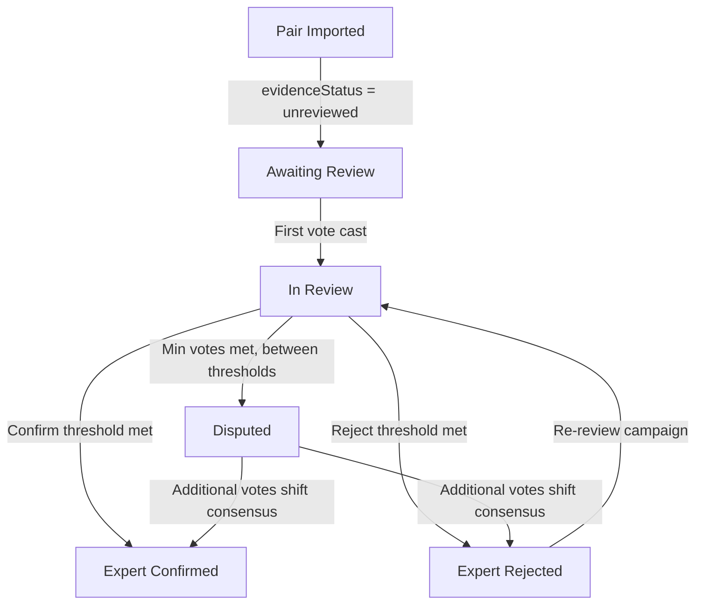

# Campaign Model Generalization & Evidence Tiers

## Problem Frame

Expert-in-the-Loop (EITL) was built around a single validation workflow: reviewers vote match/no_match on algorithm-suggested LOINC mappings. As Phenome Health's data harmonization needs grow — CDE quality review, metabolite mapping, new cohort types — the system can't support these without code changes. The pair type enum is locked to two values, scoring options are hardcoded, the CSV import drops unrecognized fields, and the review UI is coupled to LOINC-specific elements.

Separately, EITL's output lacks provenance. Votes are mutable with no audit trail. There's no distinction between "no one has looked at this" and "one person voted unsure." Validation status is computed at query time from vote percentages with hardcoded thresholds. As EITL integrates with RoP and BioMapper as the human review layer in a layered resolution pipeline, its output needs to carry explicit evidence about what kind of validation occurred.

These two problems — rigidity and shallow output semantics — are addressed together because the right generalization model incorporates evidence tiers as a core concept rather than bolting them on later.

## Pair Validation Lifecycle

Note: The `deprecated` value is reserved in the `evidenceStatus` enum but the deprecation workflow (admin UI, API, replacement pointers) is deferred to a future release.

## Requirements

**Campaign Configuration**

- R1. Campaigns carry a structured configuration object defining scoring mode, display behavior, import settings, and consensus thresholds.
- R2. Scoring modes include at minimum: binary (with custom labels), numeric scale (with configurable range and label anchors), and multi-criteria (multiple named dimensions scored independently).
- R3. Consensus thresholds are per-campaign with sensible defaults. For binary scoring: minimum votes, confirm percentage, reject percentage. For numeric scoring: minimum votes and mean threshold (mean score above/below a configurable value determines confirmed/rejected). Pairs that meet minimum votes but fall between confirm and reject thresholds are marked `disputed`.
- R4. Display configuration controls which UI elements appear in the review interface (external links, alternative selection, metadata panels) so LOINC-specific elements are not shown for non-LOINC campaigns.
- R5. Campaign templates allow admins to save and reuse configurations, reducing setup friction for recurring campaign types.

**Pair Type & Metadata Generalization**

- R6. The pair type enum is removed. Pair type becomes a free-text field like campaign type, with autocomplete from existing values.
- R7. CSV/JSON import preserves all metadata fields in the JSONB columns rather than extracting a fixed set and dropping the rest. LOINC-specific column name fallbacks (e.g., `loinc_name` → `targetText`) are removed; all imports use the column mapping wizard for field assignment.
- R8. Source prefix detection and same-source filtering become optional, configurable per campaign rather than always-on.

**Evidence Tiers**

- R9. Each pair carries an explicit `evidenceStatus` field tracking its validation lifecycle: `unreviewed`, `in_review`, `expert_confirmed`, `expert_rejected`, `disputed`, `deprecated`.
- R10. Evidence status transitions are computed synchronously on each vote submission and persisted, not derived from ad-hoc query-time calculations. Transitions follow the lifecycle defined above.
- R11. Pairs carry a `resolutionLayer` field indicating the source of the candidate mapping (e.g., authoritative cross-reference, AI-assisted, manual, unspecified). Defaults to `unspecified`. Can be set during import via column mapping (admins specify which CSV column contains resolution layer) or provided by upstream pipeline metadata.
- R12. Campaign progress reporting uses evidence tiers (e.g., "98 confirmed, 31 rejected, 8 disputed, 5 in review") rather than flat vote counts.

**Provenance & Audit**

- R13. Votes become immutable. Editing a vote creates a new vote record with a pointer to the vote it supersedes, preserving the original.
- R14. [Deferred — tracked in GitHub issue] Deprecated pairs record the reason for deprecation and a pointer to the replacement pair. The `deprecated` value remains in the `evidenceStatus` enum for future use, but the admin workflow to trigger deprecation is out of scope for this release.
- R15. Results export includes evidence status and resolution layer so downstream consumers (BioMapper, RoP pipeline) know the quality and provenance of each validated mapping.

**Review UI Generalization**

- R16. The review interface renders scoring controls dynamically based on the campaign's scoring configuration rather than hardcoding match/no_match/unsure buttons.
- R17. External link generation (currently hardcoded to loinc.org) uses a configurable link template from the campaign's display config.
- R18. The alternative selection UI (expert-selected LOINC code) is conditionally rendered based on campaign display config, not always present.

## Success Criteria

- An admin can create and run a CDE quality review campaign (with a quality scale scoring mode) without any code changes.
- An admin can create and run a metabolite mapping campaign (with different identifier types and no LOINC UI elements) without any code changes.
- Exported results carry evidence status and resolution layer metadata that distinguish "expert-confirmed after 3 reviews" from "one vote, auto-resolved."
- Vote history is fully auditable — no validation decision is silently lost or overwritten.

## Scope Boundaries

- **Not building**: Non-transitive equivalence graph logic. That belongs in BioMapper/pipeline, not in EITL's pair-level review.
- **Not building**: Content hashing for change detection. The pipeline should tell EITL when re-review is needed, not the other way around.
- **Not building**: Conformance-level assessment (RoP Levels 1-6). Could become a campaign type later, but the framework itself is out of scope.
- **Deferred**: Pair deprecation workflow (R14 removed from this release). The data model supports deprecation via `evidenceStatus = deprecated`, but the admin UI, API endpoint, and replacement-pair workflow are deferred. Track in GitHub issue.
- **Not changing**: Auth, deployment, or infrastructure. This is a model and UI refactor.

## Key Decisions

- **Combined release over phased delivery**: The model changes (evidence tiers, immutable votes, campaign config) are interdependent enough that shipping them together avoids intermediate states where the data model is half-generalized.
- **Campaign config as a single JSONB column**: One structured config object rather than individual columns for each setting. Extensible without schema migrations for new config options.
- **Evidence tiers as a core model concept, not derived views**: Storing `evidenceStatus` explicitly on pairs rather than computing it at query time. Enables efficient filtering, progress reporting, and export.
- **Immutable votes with supersession pointers**: Preserves audit trail while still letting reviewers correct their assessments. Matches RoP's deprecation-with-provenance principle.
- **Synchronous evidence status computation**: Evidence status is recomputed and persisted on each vote submission. For a single-instance Express app with low vote volume, synchronous is the clearly correct choice — async would add infrastructure complexity (no message queue, no background workers) for negligible latency savings.
- **Resolution layer as import-time metadata**: Defaults to `unspecified`. Admins can map a CSV column to resolution layer during import, or upstream pipelines can provide it. EITL stores and exports it but does not determine it algorithmically.
- **Config-driven review UI**: The review interface renders scoring controls dynamically from campaign config. Purpose-built components per scoring mode can be introduced later if the generic approach proves insufficient for UX quality.

## Dependencies / Assumptions

- The `resolutionLayer` field defaults to `unspecified`. Upstream pipelines (BioMapper, RoP) may provide it in the future; until then, admins can set it during import via column mapping.
- Existing campaigns and votes must be migrated. Current votes become the canonical (non-superseded) record. Current pairs get `evidenceStatus` computed from existing vote data. Existing campaigns get a default config matching current hardcoded behavior.
- The votes table has an existing unique constraint on `(pairId, userId)` that enforces one vote per user per pair. R13 (immutable votes with supersession) requires multiple vote records per user per pair. This constraint must be removed, and all query patterns that assume at most one vote per user per pair (vote lookup, duplicate detection, "next unvoted pair" logic) must be updated.
- The pair type column uses a PostgreSQL `pgEnum` type. Changing from enum to text requires a careful migration strategy — Drizzle's `db:push` does not handle enum-to-text type changes cleanly on production data.

## Outstanding Questions

### Deferred to Planning

- [Affects R1, R2, R3][Technical] What is the exact JSON structure for the campaign config object? Must include scoring mode config (binary labels, numeric range/anchors, multi-criteria dimensions), display config, import settings, and consensus thresholds (with scoring-mode-specific semantics per R3). Needs a Zod validation schema since Drizzle-Zod produces `z.unknown()` for JSONB columns.
- [Affects R3, R10][Technical] The current codebase computes consensus with inconsistent thresholds across four locations (0.4, 0.5, and 0.6 used in different code paths in `storage.ts` and `routes.ts`). The migration must pick one set of thresholds for backfilling `evidenceStatus` on existing pairs, and the plan should enumerate all code paths that need updating.
- [Affects R13][Technical] How should the vote supersession chain be stored? Separate `VoteHistory` table vs. `supersededBy` pointer on the votes table itself.
- [Affects R5][Technical] Should campaign templates be stored in the database or as JSON files? Database is more accessible to admins; files are version-controllable.
- [Affects R6, R13][Technical] The pairType pgEnum-to-text migration and votes unique constraint removal require a manual migration script (not db:push). Plan should specify the migration sequence and data preservation steps for both production and dev databases.

## Next Steps

-> `/ce:plan` for structured implementation planning
