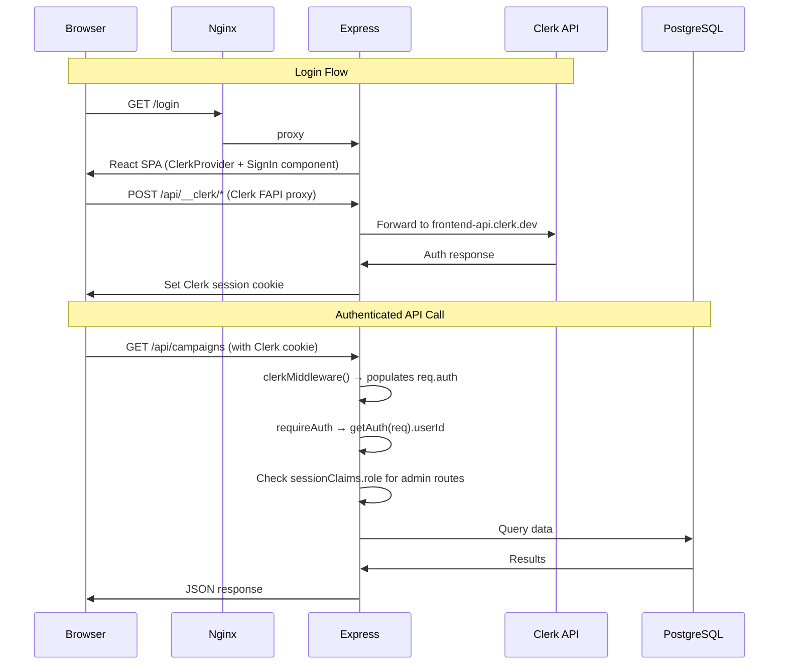

# feat: Migrate authentication from Google OAuth/Passport.js to Clerk

## Overview

Replace the entire Passport.js + Google OAuth + express-session + connect-pg-simple auth system with Clerk. This eliminates server-side session management, removes the Google OAuth callback flow, and delegates identity management to Clerk while keeping authorization logic (roles, domain whitelist) in the app. Work happens on a `feat/clerk-auth` feature branch off `dev`, PR'd back to `dev` when verified. Deploys to `dev.expertintheloop.io`.

## Problem Frame

The current auth system uses Passport.js with Google OAuth, server-side sessions stored in PostgreSQL via connect-pg-simple, and a custom domain whitelist. This works but has friction: the `connect-pg-simple` session table breaks under esbuild bundling (documented in `docs/solutions/runtime-errors/`), Google OAuth requires separate Cloud Console configuration per environment, and session management adds complexity. Clerk is already in use on two sibling projects (biomapper-ui, kraken-chatbot) with established patterns. Standardizing on Clerk simplifies auth across all projects.

## Requirements Trace

- R1. Replace Passport.js/Google OAuth with Clerk on both frontend and backend
- R2. Maintain domain-restricted access (currently `phenomehealth.org` via `allowed_domains` table)
- R3. Preserve the admin/reviewer role system
- R4. All existing API routes continue to enforce auth with same 401/403 behavior
- R5. Frontend login experience uses Clerk's SignIn component
- R6. Deploy and test on `dev.expertintheloop.io` before merging to production
- R7. Clerk FAPI proxy via Express middleware for custom domain support
- R8. Remove Passport.js, express-session, connect-pg-simple dependencies

## Scope Boundaries

- Fresh user data on dev — no migration of existing Google-based user IDs
- No changes to the production (`main`) branch until dev is verified
- No Clerk Organizations or multi-tenancy — single-tenant domain whitelist
- No Clerk Billing or subscription features
- Admin role managed via Clerk `publicMetadata`, not Clerk RBAC

### Deferred to Separate Tasks

- Production migration (merge `dev` to `main`, update prod `.env` and Clerk Dashboard): separate PR after dev verification
- Removal of `allowed_domains` table from schema: can happen after Clerk Dashboard allowlist is confirmed working
- Cleanup of Google OAuth credentials from Google Cloud Console: after production cutover

## Context & Research

### Relevant Code and Patterns

**biomapper-ui (Express + React, same stack):**
- Uses `@clerk/express@^2.0.11` with `clerkMiddleware()` mounted before body parsers
- Uses `@clerk/react@^6.2.0` with `ClerkProvider`, `proxyUrl` prop for custom domains
- Route guard pattern: `getAuth(req).userId` → `clerkClient.users.getUser()` → domain check
- FAPI proxy via `http-proxy-middleware` at `/api/__clerk`
- Domain whitelist via `ALLOWED_EMAIL_DOMAINS` env var with `phenomehealth.org` default

**Current expert-in-the-loop auth (to be replaced):**
- `server/auth.ts` — Passport.js, Google Strategy, express-session, connect-pg-simple
- `server/routes.ts` — `requireAuth`, `requireAdmin` middleware; ~12 references to `req.user!.id`
- `client/src/lib/auth.tsx` — Custom `AuthProvider` + `useAuth()` hook via TanStack Query
- `client/src/pages/login.tsx` — Custom login page with Google OAuth button
- `shared/schema.ts` — `users.id` stores Google's `sub` claim (varchar 255)

### Institutional Learnings

- `docs/solutions/runtime-errors/connect-pg-simple-session-table-esbuild-bundle-path-2026-05-06.md` — Session table auto-creation broken under esbuild. Clerk eliminates this entirely.
- kraken-chatbot `docs/solutions/best-practices/clerk-auth-react-fastapi-integration-2026-05-06.md` — Key pitfalls: never set proxyUrl in dev mode, Clerk JWTs don't contain email claims, strip content-encoding from proxy responses, use explicit auth-enabled flag.

### External References

- `@clerk/express` clerkMiddleware: `requireAuth()` **redirects** (not 401) — must write custom API guards using `getAuth()`
- `clerkClient.users.getUser()` is a network call — avoid on every request; use custom session claims for role
- Clerk Dashboard allowlist replaces `allowed_domains` table for sign-up restriction
- Proxy URL must be configured in three places: Clerk Dashboard, ClerkProvider prop, Express middleware
- `VITE_` prefix required for Vite to expose env vars to the frontend build

## Key Technical Decisions

- **Follow biomapper-ui pattern**: Same stack (Express + React), proven in production on the same Lightsail server. Use `@clerk/express` official SDK, not manual JWT verification.
- **Role via `publicMetadata`**: Store `role: "admin" | "reviewer"` in Clerk user `publicMetadata`. Include it in custom session token claims so `getAuth(req).sessionClaims.role` works without an API call per request.
- **Two-layer domain gating**: Clerk Dashboard allowlist blocks sign-up (primary gate). Server-side `ALLOWED_EMAIL_DOMAINS` env var check on `requireAuth` provides defense-in-depth (following biomapper-ui pattern). Both must agree. The `allowed_domains` DB table and its admin API routes (`/api/admin/domains`) are disabled on the dev branch — domain management moves to Clerk Dashboard and the env var. If `ALLOWED_EMAIL_DOMAINS` is missing from env, fail closed (deny all).
- **FAPI proxy via `http-proxy-middleware` with path allowlist**: Match biomapper-ui's approach at `/api/__clerk`. Restrict forwarded paths to Clerk's required prefixes (`/v1/client`, `/v1/environment`, `/v1/dev_browser`, `/.well-known/`, `/npm/`). Never forward `Clerk-Secret-Key` header back to the client in responses. This is the proven path vs. using `clerkMiddleware({ frontendApiProxy: ... })` which is newer and less tested.
- **User find-or-create on first API request**: On first authenticated API call, look up user in the `users` table by Clerk userId. If not found, create a new record using data from `clerkClient.users.getUser()`. Default role: `reviewer`.
- **Fresh start on dev**: The dev database starts clean. No need to migrate Google user IDs. Production migration will be planned separately.
- **Keep `useAuth()` hook name**: Create a thin wrapper around Clerk's hooks that exposes `{ user, isAdmin, isAuthenticated, isLoading, logout }` matching the current API, minimizing changes to consuming components.

## Open Questions

### Resolved During Planning

- **Should domain restriction be server-side or Clerk Dashboard?** Both. Clerk Dashboard allowlist is the primary gate (blocks sign-up). Server-side `ALLOWED_EMAIL_DOMAINS` env var check is defense-in-depth on `requireAuth` (following biomapper-ui pattern). The `allowed_domains` DB table and its admin routes are disabled — Clerk Dashboard is the single source of truth for domain management. If `ALLOWED_EMAIL_DOMAINS` env var is missing, fail closed (deny all requests).
- **How to handle admin role without Clerk Organizations?** Store in `publicMetadata`. First user promoted via Clerk Dashboard or API. Custom session token claim makes it available without API calls.
- **What about the `/api/auth/me` endpoint?** Replace with a lightweight endpoint that returns user data from `getAuth(req)` + `clerkClient.users.getUser()`, or rely entirely on Clerk's frontend hooks (`useUser()`). The frontend currently calls `/api/auth/me` — we'll keep it but source data from Clerk instead of Passport session.

### Deferred to Implementation

- **Exact Clerk instance/project name**: Created at implementation time in Clerk Dashboard.
- **Custom session token claim syntax**: Configured in Clerk Dashboard. Exact JSON template determined at implementation time.
- **Exact FAPI proxy path filtering implementation**: The plan requires a path allowlist. biomapper-ui doesn't filter; kraken-chatbot does. Implementation should follow kraken-chatbot's stricter approach.

## High-Level Technical Design

> *This illustrates the intended approach and is directional guidance for review, not implementation specification. The implementing agent should treat it as context, not code to reproduce.*

## Implementation Units

### Phase 1: Backend Auth Replacement

- [ ] **Unit 1: Install Clerk packages and rewrite server/auth.ts**

**Goal:** Replace Passport.js + express-session with Clerk middleware. Remove all Google OAuth and session store code.

**Requirements:** R1, R7, R8

**Dependencies:** Unit 5 (Clerk Dashboard setup must be complete — need `CLERK_SECRET_KEY` and `CLERK_PUBLISHABLE_KEY` to develop and test)

**Files:**
- Modify: `server/auth.ts`
- Modify: `package.json`

**Approach:**
- Install `@clerk/express` and `http-proxy-middleware`
- Remove `passport`, `passport-google-oauth20`, `express-session`, `connect-pg-simple` from dependencies
- Rewrite `setupAuth()` to mount: (1) FAPI proxy middleware at `/api/__clerk` before body parsers, (2) `clerkMiddleware()` before body parsers
- Rewrite `requireAuth` to use `getAuth(req).userId` and return 401 JSON (not redirect)
- Rewrite `requireAdmin` to check `getAuth(req).sessionClaims.role === "admin"` and return 403 JSON
- Add domain validation helper that calls `clerkClient.users.getUser()` and checks email domain against `ALLOWED_EMAIL_DOMAINS` env var
- Remove the `Express.User` global type declaration (no longer applicable)

**Patterns to follow:**
- biomapper-ui `artifacts/api-server/src/app.ts` — middleware mount order, `requireMapAuth` guard pattern
- biomapper-ui `artifacts/api-server/src/middlewares/clerkProxyMiddleware.ts` — FAPI proxy setup

**Test scenarios:**
- Happy path: Authenticated request with valid Clerk session → `getAuth(req).userId` returns user ID, request proceeds
- Happy path: Admin request with `role: "admin"` in session claims → `requireAdmin` passes
- Error path: Unauthenticated request → 401 JSON response (not redirect)
- Error path: Non-admin user hitting admin route → 403 JSON response
- Error path: Valid Clerk session but email domain not in `ALLOWED_EMAIL_DOMAINS` → 403 response
- Integration: FAPI proxy at `/api/__clerk` forwards requests to `frontend-api.clerk.dev` with correct `Clerk-Proxy-Url` and `Clerk-Secret-Key` headers

**Verification:**
- `npm run check` passes
- Old packages removed from `node_modules`
- No imports of `passport`, `express-session`, or `connect-pg-simple` remain

- [ ] **Unit 2: Update server/routes.ts for Clerk auth**

**Goal:** Replace all `req.user!.id` references with Clerk's `getAuth(req).userId`, update `/api/auth/*` routes.

**Requirements:** R1, R4

**Dependencies:** Unit 1

**Files:**
- Modify: `server/routes.ts`
- Modify: `server/storage.ts` (if user lookup methods need adjustment)

**Approach:**
- Remove Google OAuth routes (`/api/auth/google`, `/api/auth/google/callback`)
- Replace `/api/auth/logout` with a no-op or remove (logout handled client-side via Clerk)
- Update `/api/auth/me` to return user data sourced from `getAuth(req)` + database lookup
- Replace all `req.user!.id` with `getAuth(req).userId!` (~12 occurrences)
- Add find-or-create logic: on authenticated requests, look up user by Clerk userId in `users` table; if missing, create from Clerk user data (email, displayName from `clerkClient.users.getUser()`). The `/api/auth/me` endpoint must also trigger find-or-create (it may be the first API call a new user makes).
- Replace `req.isAuthenticated()` checks with `!!getAuth(req).userId`
- Update role management route (`PATCH /api/users/:id/role` or equivalent): must now call `clerkClient.users.updateUser(userId, { publicMetadata: { role } })` to update Clerk's `publicMetadata` alongside (or instead of) the local DB. If role only lives in session claims from Clerk, the DB role becomes a cache/audit field. The Clerk API call is authoritative.
- Disable or remove the `allowed_domains` admin routes — domain management is now via Clerk Dashboard and `ALLOWED_EMAIL_DOMAINS` env var

**Patterns to follow:**
- biomapper-ui `requireMapAuth` — getAuth → getUser → domain check → next

**Test scenarios:**
- Happy path: Existing user makes API call → user found in DB, request proceeds with correct userId
- Happy path: New Clerk user's first API call → user auto-created in `users` table with `reviewer` role
- Happy path: `/api/auth/me` returns user object with id, email, displayName, role
- Edge case: User exists in Clerk but not in DB → find-or-create handles gracefully
- Edge case: Fresh Clerk user calls `/api/auth/me` as their first API request → find-or-create triggers, user record created, user data returned
- Happy path: Admin promotes user via UI → role updated in Clerk `publicMetadata` via API call
- Error path: All 12 `req.user!.id` references work with Clerk userId format (`user_xxx`)

**Verification:**
- `npm run check` passes
- No references to `req.user` remain in server code
- All API routes still enforce auth

### Phase 2: Frontend Auth Replacement

- [ ] **Unit 3: Replace AuthProvider with ClerkProvider**

**Goal:** Replace the custom `AuthProvider` and `useAuth()` hook with Clerk's `ClerkProvider` and hooks.

**Requirements:** R1, R5

**Dependencies:** Unit 1 (FAPI proxy must be available)

**Files:**
- Modify: `client/src/App.tsx`
- Modify: `client/src/lib/auth.tsx`
- Modify: `client/src/pages/login.tsx`

**Approach:**
- Wrap app in `ClerkProvider` with `publishableKey` and `proxyUrl` props (from `VITE_` env vars)
- Pass `routerPush`/`routerReplace` props for wouter compatibility (match biomapper-ui pattern)
- Rewrite `auth.tsx` to export a `useAuth()` wrapper that maps Clerk hooks to the existing API: `{ user, isAdmin, isAuthenticated, isLoading, logout }`. This minimizes changes to consuming components.
- Replace login page with Clerk's `<SignIn />` component at `/login`
- Add `/sign-up` route with Clerk's `<SignUp />` component
- Add `ProtectedRoute` component with client-side email domain check (UX-level gate, matches biomapper-ui)
- Add `<UserButton />` component to the app header for profile/sign-out

**Patterns to follow:**
- biomapper-ui `artifacts/frontend/src/App.tsx` — ClerkProvider setup, ProtectedRoute, wouter integration

**Test scenarios:**
- Happy path: User visits `/login` → sees Clerk SignIn component → signs in with Google → redirected to dashboard
- Happy path: Authenticated user sees `<UserButton />` in header with sign-out option
- Happy path: `useAuth()` hook returns same shape as before — consuming components work without changes
- Error path: User with non-allowed email domain signs in → sees access denied message
- Edge case: User visits protected route while unauthenticated → redirected to `/login`
- Integration: ClerkProvider proxyUrl routes through `/api/__clerk` → FAPI proxy → Clerk API

**Verification:**
- `npm run check` passes
- Login page renders Clerk SignIn component
- Sign-in flow completes end-to-end on dev
- Components using `useAuth()` work without modification

- [ ] **Unit 4: Update remaining frontend components**

**Goal:** Ensure all components that reference auth work with the new Clerk-based `useAuth()`.

**Requirements:** R3, R4

**Dependencies:** Unit 3

**Files:**
- Modify: `client/src/components/app-layout.tsx`
- Modify: `client/src/pages/home.tsx`
- Modify: `client/src/pages/stats.tsx`
- Potentially modify: other components that use `useAuth()`

**Approach:**
- Audit all files that import from `@/lib/auth` — verify they work with the new hook shape
- Replace any direct references to `user.id` that assume Google ID format
- Update the app header/layout to include Clerk's `<UserButton />` instead of a custom logout button
- Remove the Google OAuth-specific error handling from any pages (e.g., `?error=domain_not_allowed` URL params)

**Test scenarios:**
- Happy path: Home page renders correctly for authenticated user with campaigns visible
- Happy path: Stats page shows user-specific data using Clerk userId
- Happy path: App layout shows UserButton with sign-out option
- Edge case: Admin-only UI elements (campaign management) show for admin users, hidden for reviewers

**Verification:**
- All pages render without errors
- Admin features accessible to admin user
- Reviewer features limited appropriately

### Phase 3: Configuration and Deployment

- [ ] **Unit 5: Clerk project setup and configuration**

**Goal:** Set up the Clerk application, configure Google OAuth social connection, domain allowlist, and custom session token.

**Requirements:** R2, R3, R7

**Dependencies:** None — but must be completed before Units 1-3 can be tested. Start this first.

**Files:**
- No repo code changes — Clerk CLI + Dashboard configuration

**Approach:**
- Use Clerk CLI (`npx clerk`) or keyless mode to create/connect a Clerk application. Alternatively, create via Dashboard if sharing the Clerk account with biomapper-ui.
- Enable Google as a social connection (Clerk manages the OAuth flow)
- Configure Restrictions → Allowlist with `phenomehealth.org` domain
- Configure Sessions → Customize session token to include `"role": "{{user.public_metadata.role}}"` 
- Configure DNS & Domains → set proxy URL to `https://dev.expertintheloop.io/api/__clerk`
- Note the `CLERK_SECRET_KEY` and `CLERK_PUBLISHABLE_KEY` for env var setup

**Test scenarios:**
Test expectation: none — Dashboard configuration, verified during integration testing in Unit 7

**Verification:**
- Clerk Dashboard shows application with Google social connection enabled
- Allowlist includes `phenomehealth.org`
- Custom session token includes role claim

- [ ] **Unit 6: Environment variables and deployment config**

**Goal:** Update dev environment variables and deploy workflow for Clerk.

**Requirements:** R6

**Dependencies:** Unit 5 (need Clerk keys)

**Files:**
- Modify: `.github/workflows/deploy-dev.yml` (add VITE_ var sourcing at build time)

**Approach:**
- Update `/home/ubuntu/expert-in-the-loop-dev/.env` on Lightsail with new Clerk env vars: `CLERK_SECRET_KEY`, `CLERK_PUBLISHABLE_KEY`, `VITE_CLERK_PUBLISHABLE_KEY`, `VITE_CLERK_PROXY_URL=https://dev.expertintheloop.io/api/__clerk`, `ALLOWED_EMAIL_DOMAINS=phenomehealth.org`
- Remove old env vars: `GOOGLE_CLIENT_ID`, `GOOGLE_CLIENT_SECRET`, `SESSION_SECRET`, `SESSION_COOKIE_NAME`
- Update deploy workflow to source `VITE_` vars from `.env` before `npm run build` (following biomapper-ui pattern: `set -a; source <(grep '^VITE_' .env); set +a`)

**Test scenarios:**
- Happy path: Deploy workflow sources VITE_ vars → build embeds Clerk publishable key → frontend initializes ClerkProvider
- Error path: Missing VITE_CLERK_PUBLISHABLE_KEY → ClerkProvider throws error at app load (fail-fast)

**Verification:**
- `VITE_CLERK_PUBLISHABLE_KEY` is embedded in the built `dist/public/assets/index-*.js`
- Old Google OAuth env vars removed

- [ ] **Unit 7: End-to-end verification on dev**

**Goal:** Verify the complete Clerk auth flow works on `dev.expertintheloop.io`.

**Requirements:** R1-R7

**Dependencies:** Units 1-6 all complete, PR reviewed by Greptile and findings addressed, PR merged to `dev`

**Files:**
- No code changes — testing and verification

**Approach:**
- Open PR from `feat/clerk-auth` → `dev`. Wait for Greptile code review, address any findings before merging. After merge → GitHub Actions deploys to dev instance
- Test: visit `dev.expertintheloop.io` → redirected to `/login` → Clerk SignIn component renders
- Test: sign in with Google (via Clerk) → redirected to dashboard
- Test: verify user created in `users` table with Clerk userId format
- Promote user to admin via Clerk Dashboard (set `publicMetadata.role = "admin"`) or via `psql`
- Test: admin features (campaign management, domain management) accessible
- Test: non-admin user cannot access admin routes (403)
- Test: `/api/__clerk` proxy serves Clerk FAPI requests (check browser network tab)

**Test scenarios:**
- Happy path: Full login → dashboard → create campaign → vote flow works
- Happy path: Admin user can manage campaigns, regular user cannot
- Error path: User with non-phenomehealth.org email cannot sign up (Clerk allowlist blocks)
- Integration: Clerk session persists across page refreshes (cookie-based, no server session)

**Verification:**
- Complete user flow works end-to-end on dev
- No Passport.js or session-related code remains active
- Clerk Dashboard shows active sessions

## System-Wide Impact

- **Interaction graph:** Auth middleware is the first middleware in the chain. Every authenticated API route passes through `clerkMiddleware()` → custom `requireAuth`/`requireAdmin`. The FAPI proxy at `/api/__clerk` is a new route surface.
- **Error propagation:** Auth failures return 401/403 JSON (same as before). Clerk middleware errors should not crash the app — they set auth state to null, which `requireAuth` catches.
- **State lifecycle risks:** Moving from server-side sessions (PostgreSQL) to Clerk's cookie-based JWT sessions. No more `session` table dependency. Session lifetime managed by Clerk (configurable in Dashboard).
- **API surface parity:** All existing API endpoints maintain the same auth requirements. The `/api/auth/*` routes change (Google OAuth routes removed, `/api/auth/me` rewritten).
- **Unchanged invariants:** The `users` table schema stays the same (id, email, displayName, role). Vote, campaign, and pair operations are unchanged. The admin/reviewer role system works identically.

## Risks & Dependencies

| Risk | Mitigation |
|------|------------|
| Clerk service outage blocks all auth | Clerk has 99.99% SLA; accept this dependency (same as Google OAuth dependency today) |
| User ID format change breaks foreign key references | Fresh database on dev — no existing data. Production migration planned separately |
| `clerkClient.users.getUser()` API call on every request adds latency | Use custom session token claims for `role`; only call `getUser()` during find-or-create |
| FAPI proxy misconfiguration breaks login | Tested pattern from biomapper-ui; verify proxy URL in Clerk Dashboard, env var, and middleware |
| Clerk publishable key not embedded in frontend build | Deploy workflow must source `VITE_` vars before build step; fail-fast if missing |
| Clerk Dashboard allowlist not configured before first deploy | Anyone with a Google account could sign up in the window before allowlist is set. Mitigation: Unit 5 (Dashboard setup) is a hard prerequisite — configure allowlist before deploying code |
| Role store split between Clerk and local DB | Role changes via admin UI must call Clerk API to update `publicMetadata`, not just local DB. Local DB role is a cache for queries, Clerk is authoritative |
| `ALLOWED_EMAIL_DOMAINS` env var missing | Server-side domain check must fail closed (deny all) if env var is absent, not default to open access |

## Documentation / Operational Notes

- Update `CLAUDE.md` to document Clerk auth configuration, env vars, and the new auth flow
- Remove Google OAuth documentation from `CLAUDE.md` (for the dev branch)
- Document how to promote users to admin via Clerk Dashboard (`publicMetadata`)
- Document the Clerk Dashboard allowlist as the primary domain restriction mechanism

## Sources & References

- **Sibling project (primary pattern):** biomapper-ui `artifacts/api-server/src/app.ts`, `artifacts/api-server/src/middlewares/clerkProxyMiddleware.ts`, `artifacts/frontend/src/App.tsx`
- **Sibling project (pitfalls):** kraken-chatbot `docs/solutions/best-practices/clerk-auth-react-fastapi-integration-2026-05-06.md`
- **Clerk Express docs:** clerkMiddleware, getAuth, requireAuth — https://clerk.com/docs/reference/express/overview
- **Clerk React docs:** ClerkProvider, useAuth, useUser — https://clerk.com/docs/react/getting-started/quickstart
- **Clerk FAPI proxy:** https://clerk.com/docs/guides/dashboard/dns-domains/proxy-fapi
- **Clerk custom session tokens:** https://clerk.com/docs/guides/sessions/customize-session-tokens
- **Clerk restrictions (allowlist):** https://clerk.com/docs/guides/secure/restricting-access
