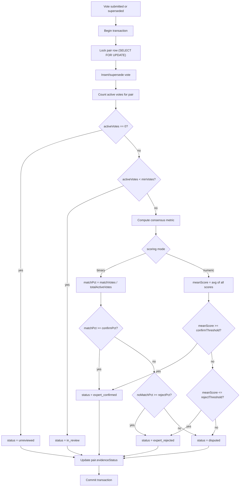

# refactor: Campaign Model Generalization & Evidence Tiers

## Overview

Generalize EITL's campaign, scoring, and review model from a LOINC-mapping-specific tool to a flexible expert validation platform. Add evidence tiers to track pair validation lifecycle and make votes immutable with provenance. This is a combined schema + storage + API + UI refactor shipped as one cohesive release.

**Clean-slate migration.** EITL has no active users yet and no downstream consumer has committed to existing classifications. Existing campaigns are **archived in place, not migrated forward** — the new evidence-tier/consensus model applies only to campaigns created after the cutover. This removes the need for a behavior-preserving backfill, a reclassification diff report, and downstream re-export coordination: there is no live data to reclassify. A maintenance-window outage during the destructive migration is acceptable. This decision is what lets the work ship as one release without the rollback/forward-recovery risk a live migration would carry.

## Problem Frame

EITL was built around one workflow: reviewers vote match/no_match on LOINC mappings. The pair type enum is locked to two values, scoring is hardcoded, CSV import drops unrecognized fields, and the review UI is LOINC-coupled. Separately, validation output lacks provenance — votes are mutable, validation status is computed ad-hoc with inconsistent thresholds (0.4, 0.5, 0.6 across four code paths), and there's no audit trail.

These problems are addressed together because the generalized model needs evidence tiers as a core concept, not a bolt-on. (see origin: `docs/brainstorms/campaign-model-generalization-requirements.md`)

## Requirements Trace

- R1. Campaign configuration JSONB object (scoring, display, import, consensus)
- R2. Scoring modes: binary (custom labels) and numeric scale; free-text reviewer notes available on every vote in both modes. (multi-criteria deferred — see Deferred to Separate Tasks)
- R3. Per-campaign consensus thresholds with scoring-mode-specific semantics
- R5. [Deferred — see Deferred to Separate Tasks] Campaign templates for reusable configurations
- R4. Display config controls which review UI elements appear (external links, alternatives, metadata panels)
- R6. Pair type enum → free-text
- R7. Import preserves all metadata; LOINC fallbacks removed
- R8. Source prefix filtering becomes optional per campaign
- R9. Explicit `evidenceStatus` on pairs
- R10. Synchronous evidence status computation on each vote
- R11. `resolutionLayer` field, defaults to `unspecified`, settable at import
- R12. Evidence-tier-based progress reporting
- R13. Immutable votes with supersession chain
- R14. [Deferred — trentleslie/expert-in-the-loop#4] Pair deprecation workflow
- R15. Export includes evidence status and resolution layer
- R16. Config-driven scoring controls in review UI
- R17. Configurable external link template
- R18. Conditional alternative selection UI

## Scope Boundaries

- **Not building**: Non-transitive equivalence, content hashing, conformance levels (see origin)
- **Not changing**: Auth, deployment, or infrastructure

### Deferred to Separate Tasks

- Pair deprecation workflow (admin UI, API, replacement pointers): trentleslie/expert-in-the-loop#4
- **Multi-criteria scoring mode** (per-dimension independent scoring): deferred — binary + numeric + free-text notes cover the near-term campaigns (CDE quality review = numeric; metabolite mapping = binary). Tracked in trentleslie/expert-in-the-loop#5. The config schema, evidence-status engine, and `ScoringControls` are kept extensible so re-adding it later is additive, not a restructure.
- **Campaign templates** (R5 — save/reuse campaign configs): deferred — no recurring campaign type exists yet, so templates have nothing to template. Admins author config directly in the editor for now (the config still persists per campaign). Add once a real recurring campaign justifies it; reuses the existing `importTemplates` pattern, so it's additive. Tracked in trentleslie/expert-in-the-loop#6.

## Context & Research

### Relevant Code and Patterns

| Area | Files | Key findings |
|------|-------|-------------|
| Schema | `shared/schema.ts` | 5 pgEnums, `pairTypeEnum` on L9, votes unique constraint on L98, JSONB columns (sourceMetadata, targetMetadata) have no Zod validation |
| Storage | `server/storage.ts` (1423 lines) | 4 inconsistent threshold locations: L364 (0.4-0.6), L664-666 (0.6/0.4), L915 (0.4-0.6), export route L436 (0.5). `updateVote` uses WHERE (pairId, userId). `getNextPairForUser` excludes any voted pair. |
| Routes | `server/routes.ts` (792 lines) | LOINC fallbacks L233-267. Source prefix detection L273-278. Vote submission catches 23505 (unique violation). Export uses 0.5 threshold. `validPairTypes` hardcoded L157. |
| Review UI | `client/src/pages/review.tsx` (961 lines) | `LoincLink` L68-86, `parseTop5Loinc` L95-129, expert alt selection L737-764, hardcoded binary buttons L837-883, hardcoded numeric labels L829-833 ("Unrelated/Tangential/Similar/Strong/Exact") |
| Campaign UI | `client/src/pages/admin/campaigns.tsx` | `createCampaignSchema` has 4 fields (name, desc, type, instructions). `CampaignTypeCombobox` with hardcoded defaults. |
| Import | `client/src/pages/admin/upload.tsx`, `client/src/components/ColumnMapper.tsx` | Column mapper already exists with required/optional field mapping. Auto-detection includes LOINC patterns. |
| Results | `client/src/pages/admin/results.tsx` | `ConsensusIndicator` uses 0.6/0.4 thresholds. Export via `/api/campaigns/:id/export`. |
| Analytics | `client/src/pages/admin/analytics.tsx` | Hardcoded numeric labels L230. Disagreement uses 40-60% thresholds. |

### Institutional Learnings

- **Migration precedent**: The Clerk auth migration (`docs/solutions/best-practices/clerk-auth-migration-express-react-2026-05-06.md`) established the pattern: test on `expertloop_dev` first, then apply to `expertloop` production. The user ID migration used email-based fallback — any schema changes to the users table or its FKs must preserve this path.
- **`db:push` limitation**: The project uses `drizzle-kit push` (destructive schema sync), not versioned migrations. Enum-to-text changes can fail or lose data via `db:push`. Manual SQL migration is required for destructive changes; `db:push` can handle additive changes (new columns) afterward.
- **Backup before migrate**: `pg_dump -U expertuser -h localhost -Fc expertloop > backup.dump`
- **Two separate databases**: `expertloop_dev` (dev, port 5001) and `expertloop` (prod, port 5000). Schema changes applied independently.

### Pre-existing Bug

`getVoteDistribution` at `server/storage.ts` L979 and `getDisagreementByConfidence` at L1257 both use `if (v.scoreBinary)` as a truthiness check — "unsure" and "no_match" are truthy strings, so they're counted as matches. These bugs must be fixed as part of this refactor since the evidence status engine depends on accurate vote counting.

## Key Technical Decisions

- **Scoring mode enforced at campaign level**: All votes in a campaign use the campaign's configured scoring mode. The per-vote `scoringMode` column is retained for historical data but new votes must match the campaign config. Eliminates undefined behavior for mixed-mode consensus computation.
- **Unsure votes count in the denominator**: For binary scoring consensus, "unsure" votes are included in the denominator (e.g., 2 match + 1 unsure = 67%, not 100%). More conservative — requires broader agreement before confirming.
- **Vote supersession via `supersededBy` pointer on votes table**: Simpler than a separate `VoteHistory` table. Add `supersededBy` (nullable UUID FK) and `isActive` (boolean, default true). All vote queries filter by `isActive = true`. Note the immutability guarantee is *logical, not physical*: vote **content** (score fields, notes) is never mutated after creation, but supersession writes the `supersededBy` and `isActive` flags on the prior row — those two columns are the only mutable fields. Downstream/audit consumers must not assume the votes table is physically append-only.
- **Transaction-wrapped vote + evidence status**: Vote insert/supersession and evidence status recomputation wrapped in a database transaction with row-level lock on the pair to prevent race conditions on concurrent votes.
- **`resolutionLayer` as text with application-level validation**: Not a pgEnum (avoiding the same inflexibility we're removing from pairType). Validated via Zod enum in the insert schema. Initial values: `authoritative_xref`, `ai_assisted`, `manual`, `unspecified`.
- **Campaign config mutable with recompute**: Config changes on campaigns with votes trigger bulk recomputation of evidenceStatus for all pairs. Admin sees a confirmation dialog that reports how many pairs will be recomputed before they confirm. Note this is the *ongoing* analogue of the one-time concern that motivated archiving existing data: once a campaign's pairs have been exported to a downstream consumer, a later threshold edit silently reclassifies already-shared results. For this release (no live consumers yet) a confirmation dialog suffices; if/when a campaign feeds BioMapper/RoP, gate threshold edits behind a re-export reminder. Tracked as a follow-up, not built here.
- **Evidence status can regress**: `expert_confirmed` can return to `disputed` or `in_review` after vote supersession. Status always reflects current consensus of active votes.
- **Default campaign config**: `{ scoring: { mode: "binary", binary: { labels: { positive: "Match", negative: "No Match", neutral: "Unsure" } } }, consensus: { minVotes: 2, confirmPct: 70, rejectPct: 70 }, display: { showExternalLinks: false, showAlternatives: false, showMetadataPanel: true }, import: { sourcePrefixFilter: false } }` (Unit 2 holds the authoritative shape). This is the conservative default for **new** campaigns and is fully tunable per campaign in the config editor. Two deliberate choices vs the legacy ad-hoc behavior: (1) **70/70** thresholds (vs the legacy 60% confirm / 40% reject) require broader agreement before a pair is confirmed/rejected; (2) **`minVotes: 2`** prevents a single unanimous vote from auto-confirming a pair — the threshold tunes *how much agreement*, `minVotes` tunes *how much evidence*, and together they realize the "confirmed after multiple reviews ≠ one vote" goal from the origin. Because existing campaigns are archived (not recomputed), this default has **no reclassification impact** — it only governs campaigns created after the cutover. **Operational caveat:** with `minVotes ≥ 2` and `getNextPairForUser` excluding any pair a reviewer has already voted on, a pair needs ≥ `minVotes` *distinct* reviewers to ever leave `in_review`. A single-reviewer campaign at the default would leave every pair permanently `in_review` — so single-reviewer campaigns must set `minVotes: 1`. Surface this in the config editor (e.g., warn when a campaign's active reviewer count < `minVotes`) so "stuck in_review for lack of reviewers" is not mistaken for "awaiting votes."
- **SQL migration for destructive changes, `db:push` for additive**: Manual SQL handles pairType enum→text and votes unique constraint removal. `db:push` handles new columns (config, evidenceStatus, resolutionLayer, supersededBy, isActive).

## Open Questions

### Resolved During Planning

- **Vote supersession storage**: `supersededBy` pointer on votes table, not separate table. Simpler queries, same audit trail.
- **Campaign templates**: Deferred (see Scope Boundaries) — no recurring campaign type exists yet to template. When added later, reuse the `importTemplates` table/route pattern (admin-guarded).
- **Consensus denominator for unsure**: Include unsure votes (user decision).
- **Scoring mode per campaign vs per vote**: Campaign-level enforcement (user decision).
- **Race conditions on concurrent votes**: Transaction with row-level lock on pair.
- **Evidence status regression**: Allowed. Status always reflects current consensus.
- **Import dedup**: Keep `sourceId + targetId` within campaign (pair type not relevant for dedup).
- **Multi-criteria scoring**: Deferred (see Scope Boundaries). This release builds only `binary` and `numeric`. The config schema and evidence-status engine are written to be extensible so the third mode is additive later.
- **Reviewer re-voting / supersession entry point**: **Audit-only.** A reviewer changes a prior decision from the vote-history page (`vote-history.tsx`), which already shows their past votes; that edit triggers supersession. The main review queue (`getNextPairForUser`) continues to exclude any pair the user has voted on, so it never re-serves a decided pair. There is **no** deliberate "re-review" surface in the main flow. The immutable-vote + supersession infrastructure earns its keep via the audit trail and correct recompute-on-edit, regardless of the entry point.
- **Vote + status atomicity**: Atomic (one transaction). If evidence status computation fails *transiently* (lock contention, deadlock) the transaction rolls back and the reviewer retries. *Deterministic* compute errors do not roll back the vote — see Unit 3's total-function + observable-fallback rule.
- **Bulk recompute batching**: Per-pair transactions (not one mega-transaction). The only trigger is an admin editing a live campaign's config (existing campaigns are archived, never recomputed). For partial-failure recovery, use a **campaign-level `recomputeStatus`** field (`idle | running | done | failed`). A crash mid-run leaves it stuck at `running` (it's only set to `done`/`failed` at the end), so add a **reconciler**: on service start (or when the admin opens the campaign-edit UI), treat any campaign with `recomputeStatus = 'running'` as `failed` and offer retry — never silently resume. A retry re-runs `computeEvidenceStatus` for **all** pairs (idempotent — recompute is a pure function of active votes + current config). Each per-pair recompute must take the **same `FOR UPDATE` lock** as a vote (Unit 3) so it can't clobber a fresher status written by a concurrent vote; config is re-read at recompute start (a config edit is the only trigger). This replaces per-pair config-version stamping. The confirmation dialog reports completion/failure. Admin operation, not reviewer-facing.

### Deferred to Implementation

- **Exact Zod schema refinements**: The campaign config Zod schema shape is defined in Unit 2 but exact field-level constraints may need tuning during implementation.
- **Analytics chart adjustments**: The exact chart layouts for evidence-tier-based analytics will be determined during UI implementation.

## High-Level Technical Design

> *This illustrates the intended approach and is directional guidance for review, not implementation specification. The implementing agent should treat it as context, not code to reproduce.*

### Campaign Config Schema Shape

```
CampaignConfig {
  scoring: {
    mode: "binary" | "numeric"          -- multi_criteria deferred (see Scope Boundaries)
    binary?: { labels: { positive, negative, neutral } }
    numeric?: { min, max, labels: Record<number, string> }
    -- multiCriteria block intentionally omitted for now; the union is written
    --   so a third mode can be added without breaking existing configs.
  }
  consensus: {
    minVotes: number (default 2)
    confirmPct: number (default 70)  -- for binary: % of all votes that are positive
    rejectPct: number (default 70)   -- for binary: % of all votes that are negative
    numericConfirmThreshold?: number  -- for numeric: mean above this = confirmed
    numericRejectThreshold?: number   -- for numeric: mean below this = rejected
  }
  display: {
    showExternalLinks: boolean
    linkTemplate?: string  -- e.g. "https://loinc.org/{targetId}"; MUST validate as
                           --   https:// scheme (reject javascript:/data:/relative);
                           --   {targetId} is URL-encoded at render time
    showAlternatives: boolean
    showMetadataPanel: boolean (default true)
  }
  import: {
    sourcePrefixFilter: boolean (default false)
    sourcePrefixes?: string[]  -- e.g. ["arivale_", "il10k_", "ukbb_"]
  }
}
```

> Free-text reviewer notes are NOT part of `CampaignConfig` — they are a per-vote field (`votes.reviewerNotes`, already in the schema) available in both scoring modes, not a configurable element.

### Evidence Status Computation Flow



**Notes on the flowchart (it is not a state machine):** Status is recomputed from scratch on every vote or supersession from the current set of active votes — there are no "allowed transitions." Any status can follow any prior status, so `expert_confirmed` can regress to `disputed` or `in_review` after a supersession. The diagram covers both scoring modes in scope (`binary` and `numeric`). The `minVotes` gate (`activeVotes < minVotes → in_review`) is what enforces the "enough evidence" rule — with the default `minVotes: 2`, a single vote leaves the pair `in_review` rather than jumping to confirmed/rejected.

## Implementation Units

### Phase 1: Schema & Data Model

- [ ] **Unit 1: SQL Migration Script**

**Goal:** Safely transform the PostgreSQL schema for destructive changes that `db:push` cannot handle.

**Requirements:** R6, R13

**Dependencies:** None (this runs first)

**Files:**
- Create: `scripts/migration-001-generalize-schema.sql`
- Create: `scripts/migration-001-rollback.sql`

**Approach:**
- Write idempotent SQL that: (1) changes `pairs.pairType` from the `pair_type` pgEnum to `text`, preserving existing (now-archived) values; (2) drops the `pair_type` pgEnum type; (3) drops the `uniqueUserPair` unique constraint on the votes table; (4) adds the constraint removal for the `skippedPairs` table if a `(pairId, userId)` UNIQUE exists there (check `\d skipped_pairs` — only drop if present). _(No `scoring_mode` enum change: multi_criteria is deferred, so the enum keeps its current values.)_
- Include a rollback script that recreates the enum and constraint. Note its **hard expiry**: re-adding the `uniqueUserPair` UNIQUE constraint FAILS once any vote has been superseded (duplicate `(pairId, userId)` rows exist), so the rollback SQL is only valid before the first supersession. After the new code is live, recovery is **restore from the pre-migration `pg_dump`**. Because existing campaigns are archived (not pulled into the new model) and there are no live users, a restore loses nothing of value — the clean-slate decision is what makes this acceptable. The rollback script should still detect duplicate active votes and abort with a clear message directing the operator to the backup.
- Test on `expertloop_dev` before touching `expertloop`.
- Backup the database before running.

**Patterns to follow:**
- The Clerk auth migration used email-based fallback for ID changes — similar careful data preservation approach.

**Test scenarios:**
- Happy path: Run migration on dev database, verify pairs.pairType column is text, existing values preserved, enum type dropped, votes unique constraint gone.
- Edge case: Run migration twice (idempotency) — second run should be a no-op or safely skip.
- Error path: Rollback script recreates enum type and constraint on a clean migration.

**Verification:**
- `\d pairs` shows `pairType` as `text` not `pair_type` enum
- `\d votes` shows no unique constraint on (pairId, userId)
- All existing data intact: `SELECT COUNT(*) FROM pairs` and `SELECT COUNT(*) FROM votes` match pre-migration counts

---

- [ ] **Unit 2: Schema Definition & Campaign Config Type**

**Goal:** Update `shared/schema.ts` with all new columns and define the CampaignConfig Zod schema as the shared contract for campaign configuration.

**Requirements:** R1, R2, R3, R6, R9, R11, R13

**Dependencies:** Unit 1 (SQL migration must have run)

**Files:**
- Modify: `shared/schema.ts`
- Create: `shared/campaignConfig.ts`

**Approach:**
- In `shared/schema.ts`:
  - Remove `pairTypeEnum` definition and change `pairs.pairType` to `text("pair_type").notNull()`
  - Leave `scoringModeEnum` as-is (binary/numeric) — multi_criteria is deferred, so no enum change is needed here
  - Add `campaigns.config` as `jsonb("config")` — **nullable, no DB default**. A JS-object application constant is NOT emitted as a SQL `DEFAULT` by Drizzle, so do not write "default DEFAULT_CAMPAIGN_CONFIG" expecting db:push to backfill it. New campaigns receive `DEFAULT_CAMPAIGN_CONFIG` at the application layer on create; `getCampaignConfig` falls back to `DEFAULT_CAMPAIGN_CONFIG` for any NULL (archived campaigns intentionally keep `config = NULL`). Do **not** add `.notNull()` (it would fail db:push on existing NULL rows).
  - Add `campaigns.recomputeStatus` as `text("recompute_status").notNull().default("idle")` (values `idle | running | done | failed`) — backs the bulk-recompute crash recovery in Unit 8 / Open Questions. As a NOT NULL column with a literal default, db:push backfills existing rows to `'idle'`.
  - Add `pairs.evidenceStatus` as `text("evidence_status").notNull().default("unreviewed")`
  - Add `pairs.resolutionLayer` as `text("resolution_layer").notNull().default("unspecified")`
  - Add `votes.supersededBy` as `uuid("superseded_by")` (nullable, FK to votes.id)
  - Add `votes.isActive` as `boolean("is_active").notNull().default(true)`
  - Remove the `uniqueUserPair` constraint definition from the votes table builder
  - Update all `createInsertSchema` calls and type exports
  - Update `CampaignWithStats`, `PairWithVotes` extended types to include new fields
- In `shared/campaignConfig.ts`:
  - Define `campaignConfigSchema` as a Zod object matching the High-Level Technical Design shape, with these **security-relevant refinements baked in (not deferred)**: `linkTemplate` must match an `https://` URL pattern (reject `javascript:`, `data:`, and relative URLs); `confirmPct`/`rejectPct` bounded to `0–100`; numeric `min < max`; label strings length-capped; `sourcePrefixes` capped (e.g. `z.array(z.string().max(64)).max(50)`). These constraints are the trust boundary for admin-authored config — specify them now, don't leave to "tuning during implementation."
  - Define `DEFAULT_CAMPAIGN_CONFIG` as a **complete** object so the `getCampaignConfig` NULL-fallback is fully populated: `{ scoring: { mode: "binary", binary: { labels: { positive: "Match", negative: "No Match", neutral: "Unsure" } } }, consensus: { minVotes: 2, confirmPct: 70, rejectPct: 70 }, display: { showExternalLinks: false, showAlternatives: false, showMetadataPanel: true }, import: { sourcePrefixFilter: false } }` — note `display.showMetadataPanel: true` and the `import` section are present (they were missing from the summary in Key Decisions; this is the authoritative shape).
  - Export TypeScript type `CampaignConfig = z.infer<typeof campaignConfigSchema>`
  - Define `EVIDENCE_STATUS_VALUES`, `RESOLUTION_LAYER_VALUES`, and `RECOMPUTE_STATUS_VALUES` as const arrays with Zod enums for validation
- The existing `votes.scoringMode` column is retained as-is for historical data — do not drop it. New votes derive scoringMode from campaign config (see Unit 4).
- Self-referencing FK: declare `supersededBy: uuid("superseded_by").references((): AnyPgColumn => votes.id)` (import `AnyPgColumn` from `drizzle-orm/pg-core` and annotate the arrow return type to break circular type inference), OR use `foreignKey({ columns: [table.supersededBy], foreignColumns: [table.id] })` in the table's extra-config callback. Without the explicit annotation, `npm run check` will fail on circular inference.
- **Verification gate before db:push**: `drizzle-kit push` has no non-applying dry-run/diff flag (it offers only `--verbose`, `--strict`, and `--force`), and `drizzle-kit generate` is unusable here because the project keeps no migrations history. Instead, verify additivity against a *throwaway scratch copy* of the migrated dev DB: restore the pre-migration `pg_dump` into a scratch database, apply the Unit 1 SQL to it, then run `drizzle-kit push --strict --verbose` against the scratch DB and read the printed statements. Confirm they are ONLY additive `ADD COLUMN` statements for the new columns, and do NOT recreate the dropped `pair_type` enum, re-add the `uniqueUserPair` constraint, or alter `scoring_mode`. Only after the scratch run is verified clean, run the real `db:push` on dev. If the scratch run wants any non-additive operation, schema.ts and the Unit 1 SQL have diverged — abort and reconcile.
- Run `npm run db:push` on dev to add the new columns (additive changes only, per the gate above)
- Run `npm run check` to verify TypeScript compilation

**Patterns to follow:**
- Existing `createInsertSchema(table).omit({...})` pattern for auto-generated Zod schemas
- Existing `$inferSelect` / `z.infer` pattern for type exports
- `importTemplates.columnMappings` as precedent for untyped JSONB — but improve by using the validated Zod schema

**Test scenarios:**
- Happy path: TypeScript compiles with `npm run check` after schema changes
- Happy path: `db:push` on dev database succeeds, new columns appear with correct defaults
- Edge case: Existing pairs have `evidenceStatus = 'unreviewed'` and `resolutionLayer = 'unspecified'` after push
- Edge case: Existing votes have `isActive = true` and `supersededBy = null` after push
- Integration: Import `CampaignConfig` type in both client and server code — types are shared correctly

**Verification:**
- `npm run check` passes
- `npm run db:push` succeeds on dev
- New columns visible in database with correct defaults on existing rows

---

### Phase 2: Storage Layer

- [ ] **Unit 3: Evidence Status Computation Engine**

**Goal:** Create the core function that computes and persists evidence status based on active votes and campaign consensus thresholds.

**Requirements:** R3, R9, R10, R12

**Dependencies:** Unit 2

**Files:**
- Modify: `server/storage.ts`
- Create: `server/evidenceStatus.ts`

**Approach:**
- Create `computeEvidenceStatus(campaignConfig, activeVotes)` pure function that returns the new status. Handles binary (percentage-based with unsure in denominator) and numeric (mean threshold) modes. For binary, pin both numerators explicitly: `matchPct = matchVotes / totalActiveVotes` and `noMatchPct = noMatchVotes / totalActiveVotes`, where `totalActiveVotes` includes unsure and unsure contributes to neither numerator.
- **Total (non-throwing) AND observable fallback**: on any internal computation error fall back to a safe status rather than throwing — because the vote insert and status update share one transaction, a throw would roll back the legitimate vote. BUT the fallback must NOT be silent: set an explicit sentinel status (`in_review`, never "leave unchanged") **and** emit a structured error log + increment a counter/metric so the bug is detectable. Rationale: config is Zod-validated on every write (Unit 5/Unit 8), so the fallback only ever fires on a genuine code bug — if it's silent, the worse the bug the quieter the failure, and a pair sits with a wrong status that flows into export. A reviewer should never be locked out by a config error, but operators must see that the fallback fired.
- Create `recomputeAndPersistEvidenceStatus(pairId, campaignId)` that wraps the computation in a transaction using the `tx` handle: `SELECT pair ... FOR UPDATE` issued via the transaction handle (NOT the global `db`), count active votes, compute status, update pair. Note: there is no existing `db.transaction()` usage in the codebase — this is greenfield. The project uses the **node-postgres** driver (`drizzle-orm/node-postgres` + `Pool` in `server/db.ts`), which supports interactive transactions and `FOR UPDATE`; use `sql\`... FOR UPDATE\`` for the row lock (Drizzle 0.39.3 has no first-class `.for('update')` on all builders). Set a bounded `lock_timeout`/`statement_timeout` on the transaction and do a small **server-side** retry on serialization/deadlock errors (40001/40P01) rather than punting an indefinite wait to the client. Keep the work inside the lock minimal (compute on already-fetched rows).
- Fix the pre-existing `scoreBinary` truthiness bug: replace `if (v.scoreBinary)` with explicit `v.scoreBinary === "match"` checks throughout storage.ts.
- Add `getActiveVotesForPair(pairId)` helper that filters `isActive = true`.

**Patterns to follow:**
- Existing Drizzle transaction pattern in storage.ts (if any — otherwise use `db.transaction()`)
- The `getCampaignResults` method's vote aggregation logic as a starting point, but corrected

**Test scenarios:**
- Happy path (binary): 3 votes (2 match, 1 no_match), minVotes=2, confirmPct=70 → 67% match → `disputed`
- Happy path (binary): 3 votes (3 match, 0 no_match), minVotes=2, confirmPct=70 → 100% → `expert_confirmed`
- Happy path (numeric): 3 votes (scores 4, 5, 4), confirmThreshold=3.5 → mean 4.33 → `expert_confirmed`
- Happy path (numeric): 3 votes (scores 1, 2, 1), rejectThreshold=2.0 → mean 1.33 → `expert_rejected`
- Edge case: 0 active votes → `unreviewed`
- Edge case: 1 vote, minVotes=3 → `in_review`
- Edge case: Unsure in denominator — 2 match + 1 unsure, confirmPct=70 → 2/3 = 67% → `disputed` (not 100%)
- Edge case: All unsure votes → 0% match, 0% no_match → `disputed` (not rejected)
- Error path: Missing campaign config → use DEFAULT_CAMPAIGN_CONFIG
- Error path: Forced internal compute error → returns `in_review` sentinel AND emits an error log / increments the fallback metric (fallback is observable, not silent)
- Integration: Transaction locks pair row, preventing concurrent status corruption; concurrent votes on the same pair serialize without indefinite waits (lock_timeout + bounded retry)

**Verification:**
- Pure computation function produces correct status for all scoring modes
- Transaction-wrapped update correctly locks and updates pair

---

- [ ] **Unit 4: Immutable Votes & Vote Supersession**

**Goal:** Replace mutable vote updates with immutable vote creation + supersession chain. Update all vote queries to filter by `isActive = true`.

**Requirements:** R13

**Dependencies:** Unit 2, Unit 3, Unit 5 (the vote endpoint derives/validates scoringMode via `getCampaignConfig`, added in Unit 5; Unit 5 does NOT depend on Unit 4, so there is no cycle — Unit 5 must simply be built first)

**Files:**
- Modify: `server/storage.ts`
- Modify: `server/routes.ts`
- Modify: `client/src/pages/vote-history.tsx` (supersession entry point — see Approach)

**Approach:**
- Replace `updateVote` method with `supersedeVote(pairId, userId, newVoteData)`: creates new vote, sets old vote's `supersededBy` to new vote's ID and `isActive = false`, calls `recomputeAndPersistEvidenceStatus`. Mark the old `createVote`/direct-insert path as internal or remove it so all vote writes go through the locking helper (a direct insert would bypass the pair row lock from Unit 3).
- **`userId` is server-authoritative**: `supersedeVote`/vote-submission must take `userId` exclusively from `getAuth(req).userId` (the existing pattern at `routes.ts` L459/L566) — never from `req.body`. The supersession query must be scoped `WHERE userId = <session userId>` so a reviewer can only ever supersede their **own** vote. With the unique constraint gone, this server-side scoping is the only thing preventing cross-user vote tampering.
- Update vote submission endpoint: if the user already has an active vote on the pair, call `supersedeVote` instead of returning 409. Remove the 23505 unique violation catch. **Derive `scoringMode` from the campaign config** (via `getCampaignConfig`, Unit 5) rather than trusting `req.body.scoringMode || "binary"`. Reject a vote whose shape mismatches the campaign's mode (e.g., `scoreNumeric` on a binary campaign) with a 400. This makes Unit 4 depend on Unit 5.
- **Supersession is audit-only (see Open Questions).** The endpoint handles re-submission defensively, but the *only* user path that reaches it is the vote-history "edit my vote" action — the main review queue never re-serves a decided pair (EXCEPTION 1). Do **not** add a re-vote affordance to `review.tsx`; the 409→supersession change is a server contract change, not a new review-flow feature.
- **Archived-campaign write guard (enforces clean-slate isolation server-side).** The vote endpoint (`POST /api/pairs/:id/vote`) must load the pair's parent campaign and **reject with 409/403 when `campaign.status` is `archived` or `completed`** — before any insert/supersede/recompute. Without this guard the archive is cosmetic: the endpoint is `requireAuth`-only and never checks status today, so a direct API call or bookmarked URL could vote on an archived pair and trigger `recomputeAndPersistEvidenceStatus` against legacy data — exactly what Unit 11 claims never happens. Likewise, `vote-history.tsx` must render votes on archived/completed campaigns as **read-only** (no "edit my vote" action), so the audit-only supersession path also can't reach archived data. This guard is what makes "archived campaigns are inert relics" true rather than assumed.
- **Systematic `isActive` filter audit** — grep `from(votes)`, `leftJoin(votes`, and `innerJoin(votes` across `server/storage.ts` (~20 hits) and add `isActive = true` to every vote read EXCEPT the three documented exceptions below. Do not rely on the list being complete — enumerate from grep. Known methods needing the filter include: `getCampaignResults`, `getCampaignExportData`, `getVoteDistribution`, `getReviewerStats`, `getUserAgreementRate`, `getHighDisagreementPairs`, `calculateKrippendorffAlpha`, `getReviewedPairsCount` (innerJoin votes — a pair counts as reviewed even if its only vote was superseded), `getAdminStats` total vote count, `getUserVotesCount`, `getUserVotesPerCampaign`, `getUserRecentActivity`, `getVotesByPair`, `getVotesOverTime`, `getSkipAnalysis` vote counts.
  - **EXCEPTION 1 — `getNextPairForUser`**: this exclusion subquery should NOT filter by isActive. A user who superseded their vote should still be excluded from seeing that pair again. Check for ANY vote by the user, active or superseded.
  - **EXCEPTION 2 — vote history** (`getUserVotes`, storage.ts L413 — there is no separate `getUserVoteHistory` method): return all votes (including superseded) but mark which are active so the UI can show the chain.
  - **EXCEPTION 3 — `getPairDetails`** (feeds the admin `PairDetailDialog` chain view, Unit 10): return all votes with an active/superseded flag, NOT filtered to active — the chain is the audit trail. Analytics/count methods still filter; only the detail/history readers return the full chain.
- Update `client/src/pages/vote-history.tsx` — this is the supersession entry point. It must (a) handle the new response shape (active flag + supersession chain), (b) use the supersession contract on its existing "edit vote" action (no 409 handling), and (c) since the reviewer is editing from a list that already shows their prior vote, the "you previously voted X" context is satisfied here naturally. **Resolved:** `getPairDetails` (feeding the admin `PairDetailDialog`, Unit 10) and the vote-history view must read the **full chain** (all votes, marked active/superseded), NOT active-only — otherwise the audit trail that justifies the immutable-vote machinery is never surfaced. `getPairDetails` is therefore treated like EXCEPTION 2 (returns all votes with an active flag), not filtered to `isActive`.
- **`isActive` audit verification gate (blocks Phase 2 completion):** after adding the filters, run `grep -nE 'from\(votes\)|leftJoin\(votes|innerJoin\(votes' server/storage.ts server/routes.ts` and confirm every hit is either (a) behind an `isActive = true` filter or (b) explicitly EXCEPTION 1, 2, or 3. A missed site silently inflates analytics with superseded votes and throws no error — do not start Phase 3 (API routes) until this grep is clean. Add an inline comment at each exception so a future contributor doesn't "fix" it.

**Patterns to follow:**
- Current `insertVote` method's Drizzle insert pattern
- Current `updateVote` for the fields that get set

**Test scenarios:**
- Happy path: User votes on pair → vote created with isActive=true, supersededBy=null
- Happy path: User supersedes vote → new vote created (isActive=true), old vote updated (isActive=false, supersededBy=new.id)
- Happy path: Multi-supersession chain (A→B→C) → only C has isActive=true
- Edge case: User votes on a pair they already superseded → still creates a new supersession (chain grows)
- Edge case: Vote counts exclude superseded votes across all analytics methods
- Error path: Invalid vote data → Zod validation rejects before database write
- Integration: Vote submission triggers evidence status recomputation → pair.evidenceStatus updates

**Verification:**
- No storage method queries votes without `isActive` filter, except the three documented exceptions (getNextPairForUser, getUserVotes, getPairDetails)
- `getNextPairForUser` excludes pairs where the user has ANY vote (active or superseded) — a superseded pair is never re-served
- Vote submission on already-voted pair supersedes rather than returning 409
- Vote submission with a scoring shape that mismatches campaign config returns 400
- Vote counts, agreement rates, and analytics are correct with superseded votes in the table

---

- [ ] **Unit 5: Campaign Config Storage & Consensus Unification**

**Goal:** Wire campaign config through the storage layer. Replace all hardcoded consensus thresholds with reads from campaign config.

**Requirements:** R1, R3, R8, R12

**Dependencies:** Unit 2, Unit 3

**Files:**
- Modify: `server/storage.ts`
- Modify: `server/routes.ts`

**Approach:**
- Add `getCampaignConfig(campaignId)` helper that reads and validates the config JSONB, falling back to `DEFAULT_CAMPAIGN_CONFIG`.
- Update campaign creation to validate config with `campaignConfigSchema.parse()`.
- Replace all 4 hardcoded threshold locations plus the export threshold with reads from campaign config:
  - `getNextPairForUser` L364: priority ordering uses campaign's thresholds
  - `getCampaignResults` L664-666: filter uses campaign's thresholds
  - `getCampaignAnalyticsSummary` L915: disagreement count uses campaign's thresholds
  - `getHighDisagreementPairs` (storage.ts L1162; disagreement threshold at L1282): filtering uses campaign's thresholds
  - Export route L436: consensus uses campaign's thresholds
- Replace computed consensus indicators with stored `evidenceStatus` reads where appropriate (R12).
- Make source prefix filtering conditional: read `config.import.sourcePrefixFilter` during import.
- **Archived-campaign read isolation**: the `GET /api/campaigns/:id/next-pair` route (`requireAuth` only today) must reject when the campaign is `archived`/`completed` so archived pairs are never served for voting. `getCampaignsWithStats` and any reviewer-facing campaign list must filter out archived campaigns server-side rather than relying on the client to hide them (the home page filter is not an isolation boundary). This is the read-side complement to the Unit 4 write guard.

**Patterns to follow:**
- Existing campaign query patterns in storage.ts
- `importTemplates.columnMappings` JSONB read pattern

**Test scenarios:**
- Happy path: Campaign with custom thresholds (60%/60%) → results filter and analytics use those thresholds
- Happy path: Campaign with no config → falls back to DEFAULT_CAMPAIGN_CONFIG
- Happy path: Progress reporting shows evidence tier breakdown (confirmed/rejected/disputed/in_review/unreviewed)
- Edge case: Campaign config has sourcePrefixFilter=true → same-source pairs filtered during import
- Edge case: Campaign config has sourcePrefixFilter=false → all pairs imported regardless of source
- Error path: Invalid config JSON → validation rejects with descriptive error
- Integration: Campaign creation with config → vote submission reads config for threshold computation

**Verification:**
- No hardcoded 0.4/0.5/0.6 threshold values remain in storage.ts or routes.ts
- Campaign results and analytics use per-campaign thresholds consistently
- Progress reporting shows evidence tier counts

---

### Phase 3: API Routes

- [ ] **Unit 6: Import Generalization**

**Goal:** Remove LOINC-specific import logic. Preserve all metadata fields. Support resolution layer mapping.

**Requirements:** R7, R8, R11

**Dependencies:** Unit 2, Unit 4, Unit 5

**Files:**
- Modify: `server/routes.ts`
- Modify: `client/src/components/ColumnMapper.tsx`
- Modify: `client/src/pages/admin/upload.tsx`

**Approach:**
- In routes.ts CSV import endpoint:
  - Remove LOINC-specific column name fallbacks (`loinc_name`, `loinc_code`, `field_name`, etc.)
  - Remove hardcoded metadata field extraction (`category`, `units`, `data_type`, `query_source`, `num_queries`, `top_5_loinc`)
  - Instead: all unmapped columns go into `sourceMetadata` or `targetMetadata` JSONB based on column mapping
  - Remove hardcoded `validPairTypes` check at L157; accept any string
  - Remove hardcoded source prefix detection function; read from campaign config if sourcePrefixFilter is enabled
  - Add `resolutionLayer` to the pair creation, defaulting to `unspecified`. **Validate the imported value server-side against `RESOLUTION_LAYER_VALUES`** (reject unknown strings). `resolutionLayer` is a provenance/trust field that flows to downstream consumers via export — treat an importer-supplied `authoritative_xref` as a claim to validate, not free text. Import is already `requireAdmin`, so any admin may set it; if finer control is later needed, restrict `authoritative_xref` to a dedicated action. Document the trust assumption.
  - Set `evidenceStatus = 'unreviewed'` on all imported pairs
  - **Metadata is stored as raw strings and rendered as text only.** Unmapped columns land in `sourceMetadata`/`targetMetadata` JSONB verbatim (no transform on write). The Unit 9 metadata panel and alternatives parser must render these via React's default text escaping — never `dangerouslySetInnerHTML` — since values are admin-CSV-supplied and otherwise a stored-XSS vector.
- In ColumnMapper.tsx:
  - Remove LOINC-specific auto-detection patterns from L608-614
  - Add `resolutionLayer` as an optional mappable field
  - Keep required fields: sourceText, sourceId, sourceDataset, targetText, targetId, targetDataset
- In upload.tsx:
  - Remove fallback to `loinc_mapping` pair type at L768
  - Use campaign type as default pair type if not mapped

**Patterns to follow:**
- Existing column mapper field definition pattern
- Current metadata JSONB storage pattern for sourceMetadata/targetMetadata

**Test scenarios:**
- Happy path: CSV with arbitrary column names → all mapped correctly, unmapped columns preserved in metadata JSONB
- Happy path: CSV with `resolution_layer` column mapped → pairs get correct resolutionLayer value
- Happy path: CSV without resolution_layer → pairs get `unspecified`
- Edge case: CSV with old LOINC-specific column names (`loinc_name`, `loinc_code`) → no auto-fallback, must be explicitly mapped
- Edge case: Import with sourcePrefixFilter enabled → same-source pairs filtered
- Edge case: Import with sourcePrefixFilter disabled → all pairs imported
- Error path: Required fields not mapped → server returns 400 with descriptive error
- Integration: Imported pairs have evidenceStatus='unreviewed' and correct resolutionLayer

**Verification:**
- No LOINC-specific string literals remain in import route
- All imported pairs have evidenceStatus and resolutionLayer set
- Column mapper offers resolutionLayer as optional field

---

- [ ] **Unit 7: Export with Evidence Metadata**

**Goal:** Update results export to include evidence status and resolution layer. Unify export consensus with stored evidence status.

**Requirements:** R15

**Dependencies:** Unit 3, Unit 4, Unit 5

**Files:**
- Modify: `server/routes.ts`
- Modify: `server/storage.ts`

**Approach:**
- Update `getCampaignExportData` to include `evidenceStatus` and `resolutionLayer` from the pairs table.
- Replace the computed `consensus` column (currently `positiveRate > 0.5 ? "match" : "no_match"`) with the stored `evidenceStatus`.
- Keep `positive_rate` as a raw metric alongside evidence status.
- Add vote supersession chain info: for each pair, count of total votes vs active votes.
- **Neutralize CSV formula injection.** Metadata JSONB and free-text fields (`sourceText`, `targetText`, `reviewerNotes`) are now exported and consumed by BioMapper/RoP operators in spreadsheet tools. Any cell value beginning with `=`, `+`, `-`, `@`, tab, or CR must be neutralized (prefix with `'` or use the `csv-stringify` quoting/sanitize option) so an imported payload can't execute on open.

**Patterns to follow:**
- Current `getCampaignExportData` CSV generation pattern
- Current `csv-stringify` usage in routes.ts

**Test scenarios:**
- Happy path: Export CSV includes evidence_status and resolution_layer columns
- Happy path: Export consensus matches stored evidenceStatus, not ad-hoc computation
- Edge case: Pair with superseded votes → export shows correct active vote count
- Edge case: Pair with no votes → evidenceStatus = 'unreviewed' in export

**Verification:**
- Export CSV contains evidence_status, resolution_layer columns
- No hardcoded 0.5 consensus threshold in export route

---

### Phase 4: Client UI

- [ ] **Unit 8: Campaign Creation with Config Editor**

**Goal:** Add a configuration editor to the campaign creation form for scoring mode, labels, thresholds, and display settings.

**Requirements:** R1, R2, R3, R4

**Dependencies:** Unit 2, Unit 5, Unit 9 (the "Preview as reviewer" affordance reuses Unit 9's `ScoringControls`; Unit 9 depends only on Units 2/5, so no cycle — build Unit 9 before Unit 8's preview, or ship the preview after `ScoringControls` lands)

**Files:**
- Modify: `client/src/pages/admin/campaigns.tsx`
- Create: `client/src/components/CampaignConfigEditor.tsx`
- Modify: `server/routes.ts` (campaign create/edit config validation)

**Approach:**
- Create `CampaignConfigEditor` component with sections: Scoring Mode (radio: **binary / numeric**), Scoring Labels (dynamic fields based on mode), Consensus Thresholds (min votes, confirm/reject percentages), Display Options (toggles for external links, alternatives, metadata panel; link template text input), Import Options (source prefix filter toggle).
- **Information architecture**: Scoring and Display sections expanded by default; Consensus Thresholds and Import Options collapsed. Include a **"Preview as reviewer"** affordance that renders a read-only `ScoringControls` (Unit 9) from the current config values, so the admin sees the reviewer's labels/scale before launching — especially important because labels flow straight through to reviewers.
- **Scoring-mode switch preserves per-mode state**: switching binary↔numeric keeps each mode's previously-entered config in local form state (switching back restores it); inactive sections render collapsed/disabled, not hidden. Only the selected mode's config is persisted on submit.
- Add config editor to the campaign creation form below the existing fields. Default to `DEFAULT_CAMPAIGN_CONFIG` — admin can expand the config section to customize.
- _(Campaign templates deferred — see Scope Boundaries. Admins author config directly per campaign; there is no template load/save in this release.)_
- **Validate config with `campaignConfigSchema.parse()` on every campaign create AND edit** (not just creation) so the reviewer-facing vote path can assume a valid stored config.
- Update campaign edit form to allow config changes with a confirmation dialog when votes exist. The dialog **shows the count of pairs that will be recomputed before the admin confirms** (not a bare "Are you sure?"). On confirm, set the campaign's `recomputeStatus = 'running'`, recompute evidenceStatus for all pairs via per-pair transactions, then `'done'`/`'failed'`. While `running`, disable the config editor and show a progress indicator (not a silent spinner that looks hung); on `done`, dismiss with a brief success note; on `failed` (or a stale `running` found on load — see the Open Questions reconciler), show a "Recompute incomplete — retry?" banner with the retry affordance. Idempotent full re-run — see Open Questions, replaces config-version stamping.

**Patterns to follow:**
- Existing `CampaignTypeCombobox` component pattern
- Existing form validation with `react-hook-form` + Zod

**Test scenarios:**
- Happy path: Create campaign with binary scoring, custom labels → config persisted correctly
- Happy path: Create campaign with numeric scoring, custom range (1-10) → config persisted
- Edge case: Create campaign without touching config → DEFAULT_CAMPAIGN_CONFIG used
- Edge case: Switch scoring mode binary→numeric→binary mid-edit → binary labels restored from preserved form state
- Edge case: Edit config on campaign with votes → confirmation dialog shows pair count, evidence status bulk-recomputed
- Error path: Invalid threshold (e.g., confirmPct > 100) or non-https linkTemplate → client-side Zod validation prevents submission

**Verification:**
- Campaign creation with custom config works end-to-end
- Default config produces the documented conservative behavior (70/70, minVotes 2)

---

- [ ] **Unit 9: Config-Driven Review UI**

**Goal:** Replace hardcoded scoring controls with dynamic rendering based on campaign config. Remove LOINC-specific UI elements.

**Requirements:** R2, R4, R16, R17, R18

**Dependencies:** Unit 2, Unit 5 (Unit 9 only *reads* campaign config via TanStack Query; it can be built in parallel with Unit 8 once Unit 5 exposes config)

**Files:**
- Modify: `client/src/pages/review.tsx`
- Create: `client/src/components/ScoringControls.tsx`

**Approach:**
- Extract scoring UI into `ScoringControls` component that reads campaign config and renders:
  - **Binary mode**: Three buttons with labels from config (e.g., "Match"/"No Match"/"Unsure" or custom)
  - **Numeric mode**: Scale buttons with range and labels from config (not hardcoded 1-5 "Unrelated…Exact"). For ranges ≤ ~10, render a wrapping button row; for larger ranges render a labeled slider so the control stays usable (the config schema caps the range, but the component must degrade gracefully).
  - _(Multi-criteria deferred — `ScoringControls` switches on `config.scoring.mode` and should keep a clean extension point for a future third mode, but renders only binary/numeric now.)_
- **Free-text reviewer notes**: keep the existing notes input available on every vote in both modes (it is a per-vote field, not config-gated).
- Replace `LoincLink` with a generic `ExternalLink` component that builds its href from `config.display.linkTemplate` by substituting `encodeURIComponent(targetId)` for `{targetId}`. Only renders when `showExternalLinks` is true. The href scheme is already constrained to `https://` by `campaignConfigSchema` (Unit 2); additionally set `rel="noopener noreferrer"` and `target="_blank"`. If the template is missing `{targetId}` or otherwise malformed, render no link rather than a broken one.
- Make expert alternative selection (`parseTop5Loinc` + select dropdown) conditional on `config.display.showAlternatives`. When enabled, parse alternatives from `targetMetadata` generically rather than specifically looking for `top_5_loinc`. Render alternative text via React's default escaping (metadata is untrusted CSV input).
- Gate the metadata panel in `review.tsx` on `config.display.showMetadataPanel` (default true — visible unless explicitly disabled). This is the consumer side of R4's metadata-panel toggle that Unit 8 exposes; without it the toggle has no effect.
- Remove hardcoded numeric scale labels ("Unrelated/Tangential/Similar/Strong/Exact").
- Remove the per-vote scoring mode toggle (binary/numeric switch) — scoring mode is now campaign-level.
- Update the vote confirmation dialog to use labels from config.

**Patterns to follow:**
- Existing `EntityCard` component structure
- Existing campaign data fetching via TanStack Query

**Test scenarios:**
- Happy path (binary): Campaign with custom labels → buttons show custom text
- Happy path (numeric): Campaign with 1-7 scale → 7 buttons with custom labels
- Edge case (numeric): Campaign with a large range (e.g., 1-50) → renders a slider, not an unusable button row
- Happy path: Campaign with showExternalLinks=true, linkTemplate="https://hmdb.ca/{targetId}" → links render to HMDB with URL-encoded targetId, rel="noopener noreferrer"
- Security: linkTemplate with a non-https scheme is rejected at config save (Unit 2); a targetId containing HTML/URL metacharacters is encoded, not injected
- Happy path: Campaign with showExternalLinks=false → no external links rendered
- Happy path: Campaign with showAlternatives=true → alternative selection dropdown visible
- Happy path: Campaign with showAlternatives=false → no alternative selection
- Happy path: Campaign with showMetadataPanel=false → metadata panel hidden in review UI (default true → visible)
- Edge case: Campaign with no config → default binary match/no_match/unsure buttons
- Edge case: Confirmation dialog shows correct labels for all scoring modes
- Integration: Vote submission sends correct scoring mode and values matching campaign config

**Verification:**
- No hardcoded "Match"/"No Match"/"Unsure" or "Unrelated"/"Exact" strings remain in review.tsx
- No `loinc.org` hardcoded URL remains
- Review UI adapts correctly to different campaign configs

---

- [ ] **Unit 10: Results, Analytics & Progress with Evidence Tiers**

**Goal:** Update results browser, analytics dashboard, and progress reporting to use evidence tiers and per-campaign thresholds.

**Requirements:** R12, R15

**Dependencies:** Unit 3, Unit 4, Unit 5, Unit 7

**Files:**
- Modify: `client/src/pages/admin/results.tsx`
- Modify: `client/src/pages/admin/analytics.tsx`
- Modify: `client/src/pages/home.tsx`

**Approach:**
- In results.tsx:
  - Replace `ConsensusIndicator` (hardcoded 0.6/0.4 thresholds) with a status badge that reads the stored `evidenceStatus` from the pair. No more client-side consensus computation. **Define a shared status presentation map (color + icon + label) for all five tiers** — e.g. unreviewed (grey, Clock), in_review (blue, Eye), expert_confirmed (green, CheckCircle), expert_rejected (red, XCircle), disputed (amber, AlertTriangle). Encode with icon **and** color (not color-only — a11y) and reuse the same palette for the stacked-bar chart and home progress bars so the five tiers read consistently everywhere.
  - Add evidence status filter to the results filter bar — **multi-select** (an admin may want "in_review OR disputed") composing with the existing search, and reflect filter state in URL query params so a filtered view is shareable. Specify the empty-result state: when a filter combination returns zero pairs, show "No pairs with status [labels] — adjust the filter" with a Clear-filter affordance, distinct from the campaign-has-no-pairs state.
  - Update `PairDetailDialog` to show the vote supersession chain (reads the **full chain** per Unit 4 EXCEPTION 3, not active-only): render a flat list with superseded votes visually de-emphasized (muted + "Superseded" badge) and the active vote prominent. Show all votes when ≤2 total; when ≥3, collapse superseded entries (active stays visible) under an "(N) prior votes" disclosure.
  - Replace the existing hardcoded `https://loinc.org/${targetId}` link in `PairDetailDialog` (results.tsx) with the Unit 9 `ExternalLink` component (config-driven, https-validated, URL-encoded) — the loinc.org literal must not survive here either.
  - All pair text/metadata shown in `PairDetailDialog` (sourceText, targetText, metadata, reviewerNotes, vote chain) renders via React's default text escaping — never `dangerouslySetInnerHTML` (metadata is untrusted CSV input).
- In analytics.tsx:
  - Replace hardcoded numeric labels ("Unrelated"…"Exact") with campaign config labels.
  - Update disagreement analysis to use stored `evidenceStatus = 'disputed'` instead of computing from threshold.
  - Add evidence tier distribution chart (stacked bar: confirmed/rejected/disputed/in_review/unreviewed) using the shared tier palette; always include all five tiers in the legend (showing 0 for empty tiers, muted) so "no disputed pairs yet" is distinguishable from "not tracked"; no zero-width unlabeled gap.
  - Render any displayed config labels / metadata via text escaping (no `dangerouslySetInnerHTML`).
  - Update Krippendorff's Alpha for the campaign-level scoring mode (binary = nominal, numeric = interval).
- In home.tsx:
  - Update campaign progress bars to show evidence tier breakdown instead of flat vote percentage.

**Patterns to follow:**
- Existing `ConsensusIndicator` component (but replacing its logic)
- Existing Recharts chart patterns in analytics.tsx
- Existing progress bar component in home.tsx

**Test scenarios:**
- Happy path: Results browser shows evidenceStatus badge per pair from stored data
- Happy path: Evidence status filter → only pairs with selected status shown
- Happy path: Analytics disagreement section uses stored disputed status
- Happy path: Home page progress bar shows "98 confirmed, 31 rejected, 8 disputed" breakdown
- Edge case: Campaign with all pairs unreviewed → progress shows 0% with unreviewed count
- Edge case: Pair with superseded votes → detail dialog shows vote chain
- Edge case: Analytics with numeric scoring → uses campaign config labels, not hardcoded
- Integration: Vote supersession → results page reflects updated evidenceStatus immediately

**Verification:**
- No hardcoded 0.4/0.5/0.6 thresholds remain in client code
- No hardcoded "Unrelated"…"Exact" labels remain in analytics
- No hardcoded `loinc.org` URL remains in results.tsx (replaced by config-driven `ExternalLink`)
- Progress reporting uses evidence tiers

---

### Phase 5: Migration & Polish

- [ ] **Unit 11: Archive Existing Campaigns (clean-slate cutover)**

**Goal:** Existing campaigns are archived in place, not migrated into the new evidence-tier model. New columns rely on their schema defaults. There is **no** evidence-status backfill, **no** resolutionLayer inference, **no** reclassification diff report, and **no** downstream notify/re-export — because no live data is being reinterpreted (see Overview: clean-slate migration).

**Requirements:** R1 (default-config aspect)

**Dependencies:** Unit 1 (enum→text + constraint drop applied), Unit 2 (new columns + `campaignConfigSchema` exist). Does **not** depend on the storage/engine units — it does not call `computeEvidenceStatus`.

**Files:**
- Create: `scripts/migration-002-archive-existing.sql`

**Approach:**
- The Unit 2 `db:push` already applies column defaults to existing rows: `pairs.evidenceStatus = 'unreviewed'`, `pairs.resolutionLayer = 'unspecified'`, `votes.isActive = true`, `votes.supersededBy = null`. No data script is needed to set those — verify they landed, don't re-write them.
- Archive every pre-cutover campaign: `UPDATE campaigns SET status = 'archived' WHERE status <> 'archived'`. Archived campaigns keep their legacy `pairType` text values (preserved by the Unit 1 cast) and their existing votes; they are read-only relics, not surfaced for new voting. Their `config` may stay NULL — `getCampaignConfig` falls back to `DEFAULT_CAMPAIGN_CONFIG` for any read, and no recompute is ever triggered on them. **"Read-only" is enforced by the server-side status guards added in Unit 4 (vote endpoint + vote-history) and Unit 5 (next-pair + campaign lists), not by the status field alone** — without those guards an archived pair could still be voted on via direct API call and would trigger recompute against legacy data.
- Do **not** set `DEFAULT_CAMPAIGN_CONFIG` on archived campaigns or compute their evidenceStatus. The new model begins with campaigns created after the cutover.
- Idempotent by construction (the `WHERE status <> 'archived'` guard).

**Patterns to follow:**
- The Clerk auth migration's approach: test on dev, verify, apply to prod.

**Test scenarios:**
- Happy path: All pre-cutover campaigns have `status = 'archived'`; new columns carry their defaults on existing rows.
- Edge case: Existing pairs with legacy `questionnaire_match`/`loinc_mapping` pairType → text value preserved after the enum→text migration; pairs remain on their archived campaign.
- Edge case: Re-running the archive SQL is a no-op (idempotent).
- Edge case: Creating a brand-new campaign post-cutover gets `DEFAULT_CAMPAIGN_CONFIG` and the full evidence-tier flow.

**Verification:**
- `SELECT COUNT(*) FROM campaigns WHERE status <> 'archived'` returns 0 immediately after the archive step (pre-cutover) — new campaigns created afterward are expected to be non-archived.
- `SELECT COUNT(*) FROM votes WHERE is_active IS NULL` returns 0 (db:push default applied).
- `SELECT COUNT(*) FROM pairs WHERE evidence_status IS NULL OR resolution_layer IS NULL` returns 0.

## System-Wide Impact

- **Interaction graph**: Vote submission now triggers evidence status recomputation → pair update. Campaign config changes trigger bulk pair recomputation. All analytics, results, and export read from stored evidence status rather than computing.
- **Error propagation**: Vote insert and evidence status update are atomic (one transaction). For *transient* failures (lock contention, deadlock) the transaction rolls back and a bounded server-side retry runs before surfacing an error to the reviewer. *Deterministic* failures (e.g. a code bug) must not roll back a valid vote — `computeEvidenceStatus` is total (falls back to the `in_review` sentinel rather than throwing) **and emits a log/metric so the fallback is observable**, and config is validated on every write. This preserves atomicity without letting a bug silently corrupt status or lock reviewers out.
- **State lifecycle risks**: Concurrent vote submissions on the same pair could race on evidence status. Mitigated by transaction with row-level lock on the pair, plus `lock_timeout`/`statement_timeout` and bounded retry so contention can't hang the request.
- **API surface parity**: The vote endpoint changes from returning 409 on duplicate to performing supersession. The only client that triggers supersession is `vote-history.tsx` (the "edit my vote" action); `review.tsx` is updated for config-driven rendering but does **not** gain a re-vote path (supersession is audit-only — the review queue never re-serves a decided pair).
- **Integration coverage**: Vote → evidence status → progress reporting chain must be tested end-to-end. Export must match stored evidence status. Campaign config → review UI → vote submission → evidence computation must flow correctly for all scoring modes.
- **Unchanged invariants**: User auth, campaign lifecycle (draft→active→completed→archived), skip pair functionality, admin role enforcement — all unchanged.

## Risks & Dependencies

| Risk | Mitigation |
|------|------------|
| `db:push` reverts the manual SQL (re-creates dropped enum / re-adds unique constraint) | schema.ts and Unit 1 SQL must agree on the end state. Run the scratch-DB additivity check (Unit 2) and apply only if output is purely additive. |
| Old code writes duplicate votes after unique constraint dropped | Stop the service for the migration window (see Migration & Deploy Sequence) so no old-code writes occur after the constraint drop. |
| Production data loss / failed rollback | Backup before any step. Rollback SQL expires at first supersession, so pg_dump restore is the recovery path — acceptable because existing campaigns are archived (clean-slate) and there are no live users, so a restore loses nothing of value. |
| Deterministic config/compute error mishandles a vote | `computeEvidenceStatus` is total (returns `in_review` sentinel, never throws) **and observable** (logs + metric on fallback); config Zod-validated on every write so the atomic vote+status transaction is neither blocked nor silently corrupted. |
| Concurrent votes on a hot pair serialize / hang | Row lock + `lock_timeout`/`statement_timeout` + bounded server-side retry on 40001/40P01 (Unit 3); minimal work inside the lock. |
| Review UI performance with config-driven rendering | Config is read once per campaign load via TanStack Query cache. No per-render config parsing. Server-side analytics parse config once per campaign, not per pair. |
| Vote queries miss `isActive` filter | Grep verification gate in Unit 4 (~20 `from(votes)` sites) blocks Phase 3 until clean. Three documented exceptions only (next-pair, vote history, pair-detail chain), commented inline. |
| Stored XSS via admin `linkTemplate` or CSV metadata | `campaignConfigSchema` constrains `linkTemplate` to `https://`; `{targetId}` URL-encoded at render; metadata rendered text-only (no `dangerouslySetInnerHTML`). |
| Privilege escalation via config/vote endpoints | Campaign config edits are `requireAdmin`; vote `userId` is server-sourced and supersession scoped to the owner. |
| CSV formula injection into BioMapper/RoP spreadsheets | Neutralize `=`/`+`/`-`/`@`/tab/CR-leading cells on export (Unit 7). |
| Bulk recompute partial failure | Campaign-level `recomputeStatus` + idempotent whole-campaign re-run (Unit 8 / Open Questions); only fires on admin config edits, never on archived data. |
| Multi-criteria scope | Deferred to a separate issue; `multi_criteria` is not in the selectable enum, so admins can't pick a non-functional mode. Engine/UI kept extensible for additive re-introduction. |

## Migration & Deploy Sequence (authoritative)

The destructive migration cannot be done zero-downtime on a single Lightsail instance. Run it inside a maintenance window with the service stopped, so the old code cannot write duplicate/mutable votes after the unique constraint is dropped. **Run the entire sequence on dev (`expertloop_dev`, service `expert-in-the-loop-dev`) first and verify before repeating it on production.** The numbered steps below use the production service/database names — substitute the dev names for the dev pass:

1. `sudo systemctl stop expert-in-the-loop` (start the maintenance window — closes the duplicate-vote race)
2. Backup: `pg_dump -U expertuser -h localhost -Fc expertloop > backup.dump`
3. `git pull` (brings the new code into the checkout)
4. Run Unit 1 SQL migration (enum→text, drop unique constraint)
5. Edit-verified `db:push` (run the scratch-DB additivity check from Unit 2 first; apply only if additive — this also applies the new-column defaults to existing rows)
6. Run `scripts/migration-002-archive-existing.sql` (archive pre-cutover campaigns; idempotent — no evidence-status backfill, no diff report)
7. `npm run build`
8. `sudo systemctl start expert-in-the-loop` (end the maintenance window)
9. (Dev pass) Verify dev thoroughly — create a new campaign via the config editor, vote, supersede from vote-history, check evidence tiers/export — before starting the production pass.

Dev and prod are migrated independently with manual `db:push` — execute the steps identically on each to avoid schema drift.

## Documentation / Operational Notes

- Update `CLAUDE.md` deployment section with the Migration & Deploy Sequence above (note the maintenance window, the clean-slate cutover — existing campaigns archived, not migrated — and that the recovery path is the pg_dump backup once supersession has occurred)
- Document the evidence status values and their meanings for downstream consumers (BioMapper, RoP), including that **archived (pre-cutover) campaigns are not part of the evidence-tier model**
- Update campaign creation docs/tooltips to explain the config options (scoring mode, thresholds, minVotes, display, link template)
- Document that the export format has changed (new columns, consensus replaced by evidence_status) and that CSV cells are formula-injection-neutralized
- Note the deferred multi-criteria mode (trentleslie/expert-in-the-loop#5) and campaign templates (trentleslie/expert-in-the-loop#6)

## Sources & References

- **Origin document:** [docs/brainstorms/campaign-model-generalization-requirements.md](docs/brainstorms/campaign-model-generalization-requirements.md)
- **RoP design principles:** [docs/rop-design-principles.md](docs/rop-design-principles.md) — evidence tiers, deprecation with provenance
- Related issues: trentleslie/expert-in-the-loop#4 (deferred deprecation workflow), trentleslie/expert-in-the-loop#5 (deferred multi-criteria scoring), trentleslie/expert-in-the-loop#6 (deferred campaign templates)
- Related code: `shared/schema.ts`, `server/storage.ts`, `server/routes.ts`, `client/src/pages/review.tsx`
