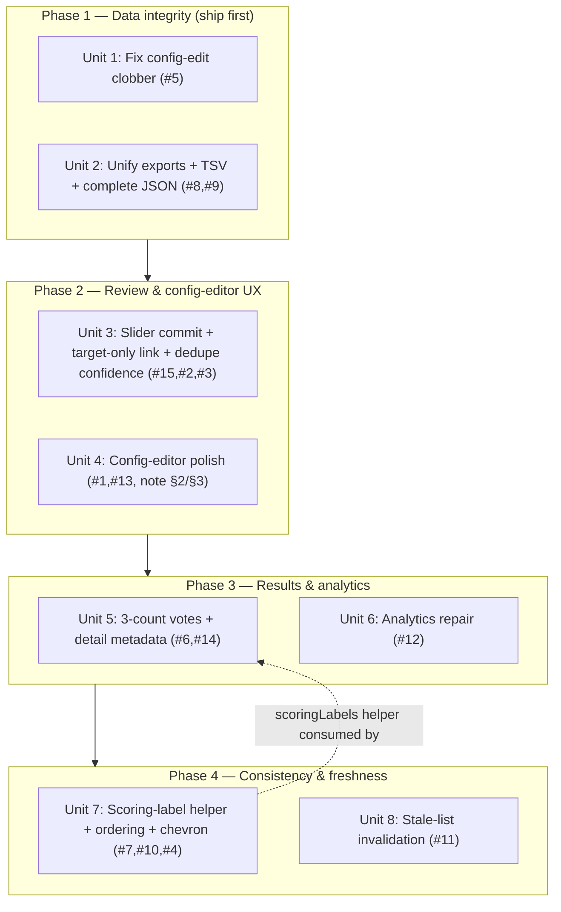

# fix: Campaign config & review UX — PR #7 QA findings

## Overview

Manual QA of PR #7 (campaign-model generalization + evidence tiers) on dev produced **15 findings** — one high-severity data-loss bug, two medium export/analytics bugs, a medium slider bug, and a cluster of UX/consistency gaps. This plan turns those findings into a single coherent branch (`feat/campaign-config-ux`) of bug fixes plus the tightly-coupled config-editor UX polish.

The full findings catalog (repro + `file:line`) lives in `docs/qa/2026-05-29-generalization-ui-qa-checklist.md` (findings table, #1–#15). This plan references findings by their catalog number.

## Problem Frame

The generalization shipped and works, but QA surfaced rough edges that range from dangerous (editing a campaign's config silently wipes it) to merely confusing (unsure votes invisible in the results table). Left unfixed, #5 risks real config data loss for admins, and #8 silently strips the headline evidence-tier outputs from JSON exports consumed by BioMapper/RoP. The rest erode trust and usability of an admin tool that's used infrequently and must be self-explanatory. (See origin: `docs/notes/2026-05-29-campaign-config-ui-followups.md` §0.)

## Requirements Trace

Each requirement maps to a QA finding (or follow-up note item). Severity in parentheses.

- **R1 (high)** — Editing an existing campaign's config must load the *saved* config and never clobber unedited fields to defaults. *(finding #5)*
- **R2 (med-high)** — All export formats must emit the same complete field set (incl. `evidence_status`, `resolution_layer`, `unsure_votes`, `expert_selections`, `reviewer_notes`); add TSV; single server-side source of truth. *(findings #8, #9; resolves #6 for JSON)*
- **R3 (med)** — Numeric slider must let the reviewer pick a value and commit deliberately. *(Mechanism, verified: votes are never cast on drag — `onValueChange` re-fires `setPendingVote`, which re-opens the existing confirmation `AlertDialog` on every drag tick. Success criterion: dragging does NOT open the confirm popup; release sets the pending value once.)* *(finding #15)*
- **R4 (med)** — Campaign Analytics **repair** (the page, routes, and section components already exist): fix the View Details navigation and the Reviewers/Disagreements tabs rendering blank, render zero-value skip stats as `0` (not blank), and make the tier bar fill width. Scoring-mode + vote-distribution panels already exist (`VoteDistributionSection`) — verify they render rather than building new ones. *(finding #12)*
- **R5 (low-med)** — Review screen: external link only on the target entity; remove the always-visible duplicate LLM confidence that defeats the bias warning. *(findings #2, #3)*
- **R6 (low-med)** — Results: votes column shows three counts (reject/unsure/accept, red/neutral/green); PairDetailDialog renders pair metadata. *(findings #6, #14)*
- **R7 (low-med)** — One canonical source for vote-choice labels (from campaign config) used in vote-history badge + edit dialog + results detail rows; negative→neutral→positive ordering app-wide; one disclosure-chevron convention. *(findings #7, #10, #4)*
- **R8 (low-med)** — Lists reflect recent changes without a manual refresh (invalidate after vote cast/edit, config save, archive, import). *(finding #11)*
- **R9 (low)** — Config editor: open-by-default on create with one-line section descriptions; advisory warning when `minVotes ≥ 2`; sensible numeric consensus-threshold defaults. *(findings #1, #13; note §2, §3)*

## Scope Boundaries

- No change to the consensus/evidence-tier engine itself (`server/evidenceStatus.ts`) — it is correct and unit-tested. This branch only fixes how config/results/exports are *presented and persisted*.
- No new scoring modes, no multi-criteria scoring, no campaign templates (all deferred upstream).
- No schema/migration changes expected — all findings are presentation, serialization, or client-state bugs over the existing model.

### Deferred to Separate Tasks

- **Reviewer/admin access-model + navigation redesign** (default-admin, role-tailored nav, single source of truth for role): own branch/plan — it touches auth + routing and is a larger design effort. *(note §5)*
- **Campaign-type → curated dropdown + per-type descriptions**: own branch — ties into the deferred templates issue (#6). *(note §1)*
- **`<script>` curator-note render spot-check on the review page** and **raw-CSV (non-wizard) upload path**: low-risk QA tail items, fold into a later verification pass.

## Context & Research

### Relevant Code and Patterns

- **Config editor:** `client/src/components/CampaignConfigEditor.tsx`, create dialog + edit dialog in `client/src/pages/admin/campaigns.tsx` (`CreateCampaignDialog`, `ConfigureCampaignDialog`).
- **Query layer:** `client/src/lib/queryClient.ts` — `getQueryFn` builds the URL from `queryKey[0]` only (root cause of #5). TanStack defaults: `staleTime: Infinity`, no refetch (root cause of #11).
- **Scoring UI:** `client/src/components/ScoringControls.tsx` (binary buttons + numeric buttons/slider; already config-driven). Slider uses `onValueChange` (#15).
- **Review screen:** `client/src/pages/review.tsx` — `ExternalEntityLink`, `EntityCard`, `ConfidenceIndicator`, LLM-reasoning accordion.
- **Results:** `client/src/pages/admin/results.tsx` — table votes column, `PairDetailDialog`, client-side JSON export builder (#8).
- **Export:** `server/routes.ts` `GET /api/campaigns/:id/export` — csv-stringify with formula-injection `cast` (the good pattern to preserve/extend); `server/storage.ts` `getCampaignExportData`.
- **Vote history:** `client/src/pages/vote-history.tsx` — hardcoded badge/edit labels (#10).
- **Analytics:** `client/src/pages/admin/analytics.tsx` (#12).
- **Config contract + defaults:** `shared/campaignConfig.ts` (`DEFAULT_CAMPAIGN_CONFIG`, `RESOLUTION_LAYER_VALUES`, zod schema).

### Institutional Learnings

- `docs/solutions/` (categories: best-practices, build-errors, workflow-issues) — the recent drizzle-zod jsonb-widening solution is relevant context for why `config` is validated with the real `campaignConfigSchema` rather than the drizzle-inferred type.
- **Testing reality:** repo uses **logic-only vitest** — no React component testing library. Existing tests: `server/evidenceStatus.test.ts`, `shared/campaignConfig.test.ts`. Plan favors extracting pure functions for vitest coverage; UI-interaction behavior is verified via the manual QA checklist (`docs/qa/2026-05-29-generalization-ui-qa-checklist.md`), which already encodes precise repros for every finding.

### External References

None — codebase has strong local patterns for every change; external research skipped.

## Key Technical Decisions

- **Fix #5 at the call site, not globally.** Change the config-edit query to a single-string key (`[`/api/campaigns/${id}`]`) so `getQueryFn[0]` resolves to the right URL, rather than changing `getQueryFn` to join segments (riskier — other query keys may carry non-URL segments). Add a comment in `queryClient.ts` documenting the footgun. **Audit predicate (precise):** the bug only manifests for a **multi-segment key with NO explicit `queryFn`** (which falls through to the default `getQueryFn`) — keys that supply their own inline `queryFn` (e.g. `results.tsx` `["/api/campaigns", id, …]`) are already safe and must NOT be "fixed." List any true positives as a follow-on hygiene task; do not convert them in this unit.
- **Single server-side export serializer.** Extract one pure serializer producing the canonical row set; CSV/TSV via csv-stringify delimiter (keeping formula neutralization), JSON via `JSON.stringify` of the same rows. Delete the client-side JSON builder. This kills the drift class that caused #8 and lands #9 (TSV) almost for free.
- **One source of truth for vote-choice labels.** New `client/src/lib/scoringLabels.ts` derives display labels from `CampaignConfig.scoring`; vote-history, results detail, and any badge consume it instead of hardcoding. Resolves #10 and the configured-labels half of #7.
- **Canonical scoring order = negative → neutral → positive** (reject/unsure/accept), matching the review buttons; apply to config-editor label inputs, results votes column, detail-dialog rows.
- **Targeted invalidation over global staleTime change.** Preserve the intentional `staleTime: Infinity` default; add `invalidateQueries` in the specific mutations (vote cast/edit, config save, archive, import). Avoids broad refetch regressions.
- **Verification harness = the QA checklist.** Because component behavior isn't unit-testable here, each UI fix's "done" criterion is the corresponding checklist item flipping from a logged finding to a pass.

## Open Questions

### Resolved During Planning

- *Should #5 be fixed globally in `getQueryFn`?* → No; call-site fix + a precise audit (multi-segment keys lacking an explicit `queryFn`) + footgun comment.
- *How to add TSV without a third code path?* → Unify exports server-side; TSV is a delimiter option.
- *Numeric threshold default values?* → Derive from range (e.g. confirm = round(max·0.7), reject = round(min + (max−min)·0.3)) or simple fixed defaults; finalize exact formula in Unit 4.
- *Does `/results` carry an unsure count for the table (#6)?* → **No** (verified, `storage.ts:101-103,180-182`). Derive client-side `voteCount − positive − negative` (no schema change).
- *Is the slider really auto-submitting (#15)?* → **No** (verified) — `onValueChange` re-opens the confirm `AlertDialog` per drag tick; fix is `onValueCommit`.
- *Is Analytics (Unit 6) missing routes/components?* → **No** (verified) — page, routes, and section components exist; Unit 6 is repair.

### Resolved by review (decisions for Unit 2)

- **JSON envelope: keep it.** Server JSON emits `{campaign, exportedAt, total, pairs:[...]}` with the newly-added fields inside each pair — additive, non-breaking for existing consumers.
- **Export scope: whole campaign for all formats.** Filters are on-screen browsing only; csv/tsv/json all export the full campaign (off `getCampaignExportData`). This changes today's JSON (which honored filters) — note it in the PR.
- **JSON HTML-encoding: downstream owns it.** Export is data interchange; do NOT mutate values. Document (PR + a code comment) that consumers HTML-encode on render. CSV/TSV keep the formula-injection neutralization.

### Deferred to Implementation

- Exact chevron convention (right→down vs down→up) — pick during Unit 7 once both call sites are in view; low-stakes either way.
- Edit-dialog default-open + descriptions (vs create-only) — Unit 4 decision; lean toward applying to edit too, since infrequent admins editing config need the descriptions just as much.
- UI polish details deferred to execution: the "neutral" color token for the unsure count (pick a gray that stays legible on the row bg), PairDetailDialog metadata badge layout in the constrained modal, and empty states for analytics panels.

## High-Level Technical Design

> *This illustrates the intended approach and is directional guidance for review, not implementation specification. The implementing agent should treat it as context, not code to reproduce.*

Units grouped into four dependency-ordered phases. Phase 1 is independently shippable (and #5 can ship as its own hotfix PR ahead of the rest).

The one cross-phase dependency: Unit 7 introduces `scoringLabels.ts`, which Unit 5's detail-dialog rows ideally consume. If Unit 5 lands first, it can inline the lookup and Unit 7 refactors it into the shared helper.

## Implementation Units

- [x] **Unit 1: Fix config-edit clobber (#5)** — ✅ shipped (commit `0f21dec`)

**Goal:** The Configure-campaign dialog loads the campaign's *saved* config; saving never reverts unedited fields to defaults.

**Requirements:** R1

**Dependencies:** None (ship-first candidate)

**Files:**
- Modify: `client/src/pages/admin/campaigns.tsx` (`ConfigureCampaignDialog` query)
- Modify: `client/src/lib/queryClient.ts` (footgun comment + dev-time guard, below)
- Test: `client/src/lib/queryClient.test.ts` (new — assert URL construction from a single-string key)

**Approach:**
- Change the dialog's query key from `["/api/campaigns", campaign.id]` to a single-string key that `getQueryFn` resolves correctly (e.g. `[`/api/campaigns/${campaign.id}`]`), so it fetches the detail endpoint and `fullCampaign.config` is the real config.
- Audit for the precise footgun: `grep` for multi-segment `queryKey` arrays and keep only those **without** an explicit `queryFn` (those fall through to `getQueryFn[0]`). Enumerate each true positive with its resolution (single-string key) in the PR; fixing them beyond the config dialog is a follow-on task, not part of this unit.
- Keep the existing `useEffect` that parses `fullCampaign.config` via `campaignConfigSchema` (good defensive default fallback stays).
- **Add a dev-time guard in `getQueryFn`** (resolved decision): when `import.meta.env.DEV` and a query key has >1 segment with no explicit `queryFn`, `console.warn` that it will fetch `queryKey[0]` only. Cheap recurrence insurance so the footgun surfaces loudly instead of silently fetching the wrong URL for future code.

**Patterns to follow:** existing single-string keys elsewhere in the app that already work with `getQueryFn`.

**Test scenarios:**
- Happy path (vitest): given a single-string detail key, `getQueryFn` fetches that exact URL.
- Edge case (vitest): a key with extra non-URL segments is not silently turned into a wrong URL (documents the footgun).
- Integration (manual QA, checklist finding #5): open Configure on a campaign with non-default config (custom labels, external links, minVotes) → editor shows the *saved* values; change one field, save → only that field changes; other settings persist (verify via DB as in the QA repro).

**Verification:** Re-running the finding-#5 repro on dev shows the editor pre-populated with saved config and a one-field save that does not wipe siblings.

- [x] **Unit 2: Unify exports server-side + TSV + complete JSON (#8, #9)** — ✅ shipped

**Goal:** One server endpoint serves csv | tsv | json from the same canonical rows; JSON gains the dropped fields; TSV added; client JSON builder removed.

**Requirements:** R2

**Dependencies:** None

**Files:**
- Create: `server/exportSerializer.ts` (pure: rows + format → string/payload)
- Modify: `server/routes.ts` (`GET /api/campaigns/:id/export` → branch on `?format=csv|tsv|json`)
- Modify: `client/src/pages/admin/results.tsx` (`handleExport` — all formats hit the server; delete client-side JSON construction; add TSV to the format dropdown)
- Test: `server/exportSerializer.test.ts` (new)

**Approach:**
- Extract the existing `csvData` row mapping into the serializer so all formats share one field list (incl. `evidence_status`, `resolution_layer`, `positive/negative/unsure_votes`, `expert_selections`, `reviewer_notes`).
- CSV/TSV via csv-stringify (`delimiter: "\t"` for TSV), preserving the leading-`'` formula-injection `cast`. **JSON keeps the envelope** `{campaign, exportedAt, total, pairs:[...]}` (resolved decision) with the canonical fields inside each pair — not a flat array.
- **All formats export the whole campaign** off `getCampaignExportData` (resolved decision: filters are on-screen only). Note in the PR that this changes the old filtered-JSON behavior.
- **JSON HTML-encoding is the consumer's responsibility** (resolved decision) — do not encode/mutate values server-side; add a code comment + PR note. CSV/TSV retain the leading-`'` neutralization.
- Set `Content-Type`/filename per format (`text/csv`, `text/tab-separated-values`, `application/json`).
- **Security hardening (from review):**
  - **Validate `?format` against an allowlist** `['csv','tsv','json']` → HTTP 400 on anything else (don't fall through to a default branch).
  - **Sanitize the `Content-Disposition` filename** derived from `campaign.name` — strip to alphanumeric/`-`/`_` (the current code only replaces whitespace, `routes.ts:522`), or use the RFC 5987 `filename*=UTF-8''…` form, to prevent header injection via campaign names.
  - **Keep `requireAdmin` on the unified route for all formats** (`routes.ts:476`) — JSON/TSV must not become reviewer-accessible; the export carries free-text `reviewer_notes`.
  - **TSV cell safety:** beyond the leading-char neutralization, ensure embedded `\n`/`\t` in cell values are quoted/escaped so they can't break TSV row structure.

**Patterns to follow:** existing csv-stringify `cast` neutralizer in `server/routes.ts:511–519`; `getCampaignExportData` in `server/storage.ts`.

**Test scenarios:**
- Happy path (vitest): serializer rows include all canonical fields for confirmed/rejected/disputed/unsure/unreviewed pairs.
- Happy path (vitest): JSON output field set == CSV column set (regression guard against drift).
- Edge case (vitest): a `reviewer_notes`/text cell starting with `=`, `+`, `-`, `@` is neutralized with leading `'` in CSV and TSV.
- Edge case (vitest): TSV uses tab delimiter and quotes/escapes cells containing tabs or newlines (no row-structure break).
- Edge case (vitest): an unsure-only pair reports `unsure_votes: 1`, `positive/negative: 0`, and carries `evidence_status: disputed`.
- Error path (vitest): `?format=xml` (or any non-allowlisted value) returns HTTP 400, not an empty 200.
- Error path (vitest/integration): a non-admin request to `?format=json` and `?format=tsv` returns 403.
- Edge case (vitest): a campaign name with `"`/`;`/CRLF produces a safe `Content-Disposition` filename (no header injection).
- Parity (vitest): for an unchanged column set, each column's values + ordering + formula-neutralization are identical to the pre-refactor output (per-column assertions, NOT a whole-file byte snapshot — intended new columns would break a snapshot).

**Verification:** Exported JSON for test4 contains `evidence_status`/`resolution_layer`/`unsure_votes`; a TSV download opens tab-delimited; CSV injection still neutralized (checklist §8).

- [x] **Unit 3: Review scoring & display fixes — slider commit, target-only link, dedupe confidence (#15, #2, #3)** — ✅ shipped (UI; verify on dev)

**Goal:** Numeric slider selects-then-commits; external link renders only on the target; the always-visible duplicate confidence is removed.

**Requirements:** R3, R5

**Dependencies:** None

**Files:**
- Modify: `client/src/components/ScoringControls.tsx` (slider: `onValueChange` → local pending value; cast on `onValueCommit` or an explicit Submit button)
- Modify: `client/src/pages/review.tsx` (`EntityCard`/`ExternalEntityLink` only linkify the target entity; remove the always-visible `ConfidenceIndicator` block, keep the in-accordion confidence)

**Approach:**
- Slider: move the `onSelect`/`setPendingVote` call from `onValueChange` to `onValueCommit` (Radix Slider exposes it) so the **existing** confirmation `AlertDialog` opens once on release — matching the binary flow — rather than re-firing per drag tick. Do NOT cast the mutation directly from the slider; keep the pending→confirm contract. Button-row behavior (deliberate click) is unchanged.
- Link: pass an `isTarget`/entity-type flag so only the target ID becomes an `<a>`; source IDs render as plain text (keeps `encodeURIComponent`).
- Confidence: delete the duplicate `ConfidenceIndicator` so confidence appears only inside the bias-gated reasoning accordion.

**Patterns to follow:** existing `Slider` usage; `encodeURIComponent` in `ExternalEntityLink`.

**Test scenarios:**
- Edge case (vitest, if a pure helper is extracted): "commit-on-release" selection logic returns the released value, not intermediate drag values.
- Integration (manual QA, checklist §2 slider): dragging the slider does not open the confirmation popup; releasing on a value (or pressing Submit) casts that value.
- Integration (manual QA, checklist §2 links): target ID is a link to `https://…/{encodedTargetId}`; source ID is plain text.
- Integration (manual QA, checklist §2 confidence): confidence appears only when the reasoning accordion is expanded.

**Verification:** Checklist §2 slider/links/confidence items flip to pass; finding #2 and #3 cleared.

- [x] **Unit 4: Config-editor UX polish — default-open, descriptions, minVotes warning, numeric defaults (#1, #13; note §2, §3)** — ✅ shipped

**Goal:** On create, the config editor is open with one-line section descriptions; a warning shows when `minVotes ≥ 2`; numeric thresholds have sensible defaults.

**Requirements:** R9

**Dependencies:** None

**Files:**
- Modify: `client/src/components/CampaignConfigEditor.tsx` (section descriptions; `minVotes ≥ 2` advisory; numeric threshold defaults on mode switch)
- Modify: `client/src/pages/admin/campaigns.tsx` (`CreateCampaignDialog` — `configOpen` defaults `true` on create)
- Modify/Test: `shared/campaignConfig.ts` + `shared/campaignConfig.test.ts` (numeric default derivation as a pure helper)

**Approach:**
- Default-open on *create* only (edit dialog may stay collapsed — revisit). Add muted one-sentence helper text under each section header (copy from note §2).
- Conditional helper under `minVotes`: when `≥ 2`, warn that that many distinct reviewers are required or pairs sit in `in_review` (fires at ≥2, NOT at 1 — see finding #1).
- Numeric defaults: when switching to numeric (or on first numeric render with empty thresholds), seed `numericConfirmThreshold`/`numericRejectThreshold` from the range via a pure helper.

**Patterns to follow:** existing muted helper text (`text-xs text-muted-foreground`) and `FieldError` in `CampaignConfigEditor.tsx`.

**Test scenarios:**
- Happy path (vitest): numeric-default helper returns confirm > reject within [min, max] for ranges 1–5, 1–10, 1–100.
- Edge case (vitest): the `minVotes` warning predicate is true for ≥2 and false for 1.
- Integration (manual QA, checklist §1): creating a campaign shows the editor expanded with descriptions; `minVotes 2` shows the warning, `1` does not; a fresh numeric campaign has pre-filled thresholds.

**Verification:** Findings #1, #13 cleared; note §2/§3 satisfied.

- [x] **Unit 5: Results browser — three-count votes column + detail-dialog metadata (#6, #14)** — ✅ shipped

**Goal:** Votes column shows reject/unsure/accept (red/neutral/green); PairDetailDialog renders source/target metadata.

**Requirements:** R6

**Dependencies:** Soft — consumes `scoringLabels.ts` from Unit 7 if landed; otherwise inline and let Unit 7 refactor.

**Files:**
- Modify: `client/src/pages/admin/results.tsx` (votes column → 3 counts; `PairDetailDialog` → metadata badges)

**Approach:**
- **Corrected:** `/results` does NOT return an unsure count — `getCampaignResults` projects only `voteCount`, `positiveVotes`, `negativeVotes` (`server/storage.ts:101-103, 180-182`). Derive unsure **client-side** as `voteCount − positiveVotes − negativeVotes` (`voteCount` counts all active votes). This keeps the no-schema-change boundary. *(Alternative, deferred: add an `unsureVotes` SUM to the `getCampaignResults` SQL if a future consumer needs it server-side — not required for this fix.)*
- Render three counts in negative/neutral/positive order with red/neutral/green coloring.
- Add metadata badge rendering to `PairDetailDialog` mirroring the review screen's `EntityCard` metadata display.
- **Security (XSS):** render all user-supplied string fields (text, metadata values, `curator_note`, reviewer notes) exclusively as React text nodes — never via `dangerouslySetInnerHTML` — matching `review.tsx`'s `{String(value)}` pattern. This unit adds a new render surface for the imported ``/`<script>` payloads, so the previously-deferred `<script>` curator-note render check is promoted to a Unit 5 verification step.

**Patterns to follow:** review screen metadata badges (`review.tsx` `EntityCard`); existing results table cells.

**Test scenarios:**
- Happy path (vitest, if count-derivation is extracted): a pair with votes {match, no_match, unsure} maps to accept/reject/unsure counts in canonical order.
- Integration (manual QA, checklist §4): SRC011 (disputed-by-unsure) shows `0/1/0` (reject/unsure/accept), not `0/0`; the detail dialog shows `kegg_id`/`pubchem_cid`/`curator_note` badges.

**Verification:** Findings #6, #14 cleared; "0/0 but Disputed" no longer possible.

- [x] **Unit 6: Analytics page repair (#12)** — ✅ shipped (root cause was the queryFn footgun)

**Goal:** Repair the existing Analytics page — View Details navigates, Reviewers/Disagreements tabs render their data, skip stats show `0`, tier bar fills width.

**Requirements:** R4

**Dependencies:** None

**Files:**
- Modify: `client/src/pages/admin/analytics.tsx`
- Modify (only if a defect is data-side): `server/routes.ts` / `server/storage.ts` for a specific analytics endpoint returning wrong/empty data
- Test: extend a `server/*.test.ts` only if an aggregation is corrected

**Approach:**
- **Verified during planning:** the page, all routes (`/api/analytics/campaigns/:id/{votes,reviewers,disagreements,skips}`, `routes.ts:767-802`), and all section components (`VoteDistributionSection`, `EvidenceTierSection`, `ReviewerStatsSection`, `DisagreementSection`, `SkipAnalysisSection`) **already exist** — this is repair, not build. The reported blank pages are a navigation/render/empty-data defect, not missing code.
- **Root cause found during Unit 1's audit:** the four analytics detail queries — `voteDistribution`, `reviewerStats`, `disagreements`, `skipAnalysis` (`analytics.tsx:827-845`) — use multi-segment keys `["/api/analytics/campaigns", selectedCampaign, "<section>"]` with **no `queryFn`**, so the default `getQueryFn` fetches `queryKey[0]` = `/api/analytics/campaigns` (the list) instead of `/api/analytics/campaigns/:id/<section>`. This is the #5 footgun again and explains the blank Reviewers/Disagreements/skip data. **Fix:** give each an explicit `queryFn` hitting the correct detail URL (or a single-string key). This is the bulk of finding #12.
- **Execution note:** also reproduce the remaining #12 defects (the "View Details" handler at `analytics.tsx:949` uses a DOM-click workaround — likely the navigation bug; tier-bar width; zero-value skip rendering).
- Fix the View Details navigation (prefer a proper state/router update over the DOM-click); ensure Reviewers/Disagreements render with data (or a real empty state); render `0` for zero-value skip stats; make the evidence-tier distribution `ResponsiveContainer` fill width. Confirm the scoring-mode + vote-distribution panels in `VoteDistributionSection` actually render before assuming any panel is missing.

**Patterns to follow:** existing chart/card components in `analytics.tsx`; `getCampaignExportData`/results aggregations for vote distributions.

**Test scenarios:**
- Happy path (vitest): any new server aggregation returns correct counts (zero campaigns, single campaign, mixed tiers).
- Edge case (vitest): zero-skip campaign yields `{ totalSkips: 0, uniquePairs: 0, skipRate: 0 }`, not null/blank.
- Integration (manual QA, checklist §6): View Details/Reviewers/Disagreements load non-blank pages; skip stats show `0`; tier bar fills the card width.

**Verification:** Finding #12 sub-items cleared; checklist §6 analytics item flips to pass.

- [ ] **Unit 7: Scoring-label helper + ordering + chevron consistency (#7, #10, #4)**

**Goal:** One config-derived source of vote-choice labels used everywhere; negative→neutral→positive ordering app-wide; a single disclosure-chevron convention.

**Requirements:** R7

**Dependencies:** None (provides the helper Unit 5 can consume)

**Files:**
- Create: `client/src/lib/scoringLabels.ts` + `client/src/lib/scoringLabels.test.ts`
- Modify: `client/src/pages/vote-history.tsx` (badge + edit dialog use configured labels)
- Modify: `client/src/components/CampaignConfigEditor.tsx` (label inputs → negative/neutral/positive order; chevron convention)
- Modify: `client/src/pages/admin/results.tsx` (detail-dialog vote rows show the choice via the helper)
- Modify (chevron): `client/src/pages/review.tsx` *or* `CampaignConfigEditor.tsx` to converge on one chevron idiom

**Approach:**
- `scoringLabels.ts`: given a `CampaignConfig` and a vote, return its configured label; centralizes what vote-history/results currently hardcode ("Confirmed/Rejected/Unsure"). `ScoringControls` already derives labels from config — treat it as the reference and, ideally, the helper's first adopter so all label derivation shares one path.
- **Numeric campaigns matter here too** (vote-history/results show both modes): for a numeric vote, return the configured per-value label from `scoring.numeric.labels` keyed by the score, falling back to the raw score string when no label is configured (mirror `ScoringControls`' numeric rendering). Define this explicitly so numeric vote rows don't render blank.
- Reorder config-editor label inputs to negative→neutral→positive (matches review buttons and the votes column).
- Pick one chevron convention (collapsed→expanded) and apply to both the custom `Collapsible` and the review `Accordion`.

**Patterns to follow:** `ScoringControls` already reads labels from config — extend that idea into a shared helper.

**Test scenarios:**
- Happy path (vitest): `scoringLabels` returns custom binary labels for a binary config.
- Happy path (vitest): for a numeric config, returns the configured per-value label for a scored value; returns the raw score string when that value has no configured label.
- Edge case (vitest): missing/partial labels don't throw; return a safe default (never blank).
- Integration (manual QA, checklist §3/§2): vote-history badge + edit dialog show the campaign's labels (e.g. "Match/No Match/Unsure"), not "Confirmed/Rejected"; chevrons consistent across config editor and review.

**Verification:** Findings #7, #10, #4 cleared.

- [ ] **Unit 8: Stale-data invalidation across lists (#11)**

**Goal:** Vote-history, review queue, results, and campaign lists reflect changes without a manual refresh.

**Requirements:** R8

**Dependencies:** None

**Files:**
- Modify: `client/src/pages/review.tsx` (after vote cast)
- Modify: `client/src/pages/vote-history.tsx` (after vote edit)
- Modify: `client/src/pages/admin/campaigns.tsx` (after config save, archive, create)
- Modify: `client/src/pages/admin/upload.tsx` (after import)

**Approach:**
- Add `queryClient.invalidateQueries` for the affected keys in each mutation's `onSuccess`. Be explicit about the **cross-page** invalidations the QA repros require — e.g. a **vote edit from vote-history must also invalidate the results query** (the `/api/campaigns/:id/results` key) and campaign stats, not just the vote list, or the results page stays stale (one of the three reported repros). Map each mutation → the full set of keys it staleness-affects (vote lists, results, campaign list/detail, stats).
- Keep the global `staleTime: Infinity` default; this is targeted invalidation, not a global refetch policy change.

**Patterns to follow:** the existing `invalidateQueries(["/api/campaigns"])` in `campaigns.tsx` (`handleRefresh`).

**Test scenarios:**
- Integration (manual QA, checklist finding #11, all 3 repros): after a vote edit and navigating back, vote-history reflects it without refresh; after activating + importing, the review page serves the first pair without refresh; after a config save, dependent views update.

**Verification:** None of the three #11 stale repros require a manual refresh.

## System-Wide Impact

- **Interaction graph:** Unit 1 touches the shared `getQueryFn` contract (via the audit) — verify no other query relies on the `queryKey[0]`-only quirk. Unit 8 adds invalidation at every vote/config/import mutation seam.
- **Error propagation:** Unit 2's serializer must surface a clear error (not a half-written file) on bad data; the export route keeps its existing 500 handler.
- **State lifecycle risks:** Unit 8 must invalidate (not optimistically mutate) to avoid showing stale tiers after a recompute; Unit 1 must not reintroduce a wrong-endpoint fetch.
- **API surface parity:** Unit 2 changes `/export` to accept `?format`; the client is the only consumer — update it in the same unit. Unit 5 may extend the `/results` response with `unsureVotes`.
- **Integration coverage:** export field-set parity (Unit 2) and config round-trip (Unit 1) are the cross-layer behaviors unit tests + the QA checklist must jointly prove.
- **Unchanged invariants:** the evidence-tier engine, the config schema/`DEFAULT_CAMPAIGN_CONFIG` shape, and the CSV formula-injection neutralization all remain behaviorally identical — for any **unchanged CSV column**, the serializer must emit identical values, ordering, and neutralization (verified by per-column assertions, not a whole-file byte snapshot, since intended new columns change the file).

## Risks & Dependencies

| Risk | Mitigation |
|------|------------|
| #5 call-site fix misses other `[base, id]` queries with the same latent bug | Explicit repo-wide audit in Unit 1; list findings in the PR. |
| Export serializer extraction changes CSV output subtly (column order, quoting) | Per-column parity assertions in `exportSerializer.test.ts` (values + ordering + neutralization for unchanged columns), not a brittle byte snapshot. |
| Unifying JSON export breaks downstream consumers (envelope shape and filtered-vs-whole-campaign semantics differ from the current client builder) | **Open decision** — see Open Questions; confirm BioMapper/RoP's JSON contract before changing the JSON shape/scope. |
| Analytics (Unit 6) scope inflated | De-risked during review: page/routes/components already exist (verified); Unit 6 is narrow repair, not build. |
| UI-only fixes can't be unit-tested here | Lean on the QA checklist as the regression harness; extract pure helpers wherever feasible (slider commit, labels, numeric defaults, vote counts). |
| Over-invalidation (#8 fix) causes excessive refetch | Targeted per-mutation invalidation, not a global `staleTime` change. |

## Documentation / Operational Notes

- **Branch:** create `feat/campaign-config-ux` off `dev`; PRs target `dev` (per project PR workflow — never deploy directly).
- **Shippability:** Phase 1 (Units 1–2) is independently mergeable; #5 (Unit 1) can go as its own hotfix PR ahead of the rest given its severity.
- **No `db:push` expected** — confirm before merge that no unit introduced a schema change.
- **Regression harness:** as each unit lands, flip its finding(s) in `docs/qa/2026-05-29-generalization-ui-qa-checklist.md` from open to verified; keep that doc as the living QA record.
- Update the follow-ups note §0 status as items close.

## Sources & References

- **Origin documents:** `docs/notes/2026-05-29-campaign-config-ui-followups.md` (§0 priority bugs + UX items), `docs/qa/2026-05-29-generalization-ui-qa-checklist.md` (findings table #1–#15)
- Upstream requirements: `docs/brainstorms/campaign-model-generalization-requirements.md`; PR #7 plan: `docs/plans/2026-05-28-001-refactor-campaign-model-generalization-plan.md`
- Test fixture: `docs/qa/fixtures/qa-metabolite-pairs.csv`
- Key code: `client/src/lib/queryClient.ts`, `client/src/components/CampaignConfigEditor.tsx`, `client/src/components/ScoringControls.tsx`, `client/src/pages/review.tsx`, `client/src/pages/admin/results.tsx`, `client/src/pages/admin/analytics.tsx`, `client/src/pages/vote-history.tsx`, `server/routes.ts`, `server/storage.ts`, `shared/campaignConfig.ts`
