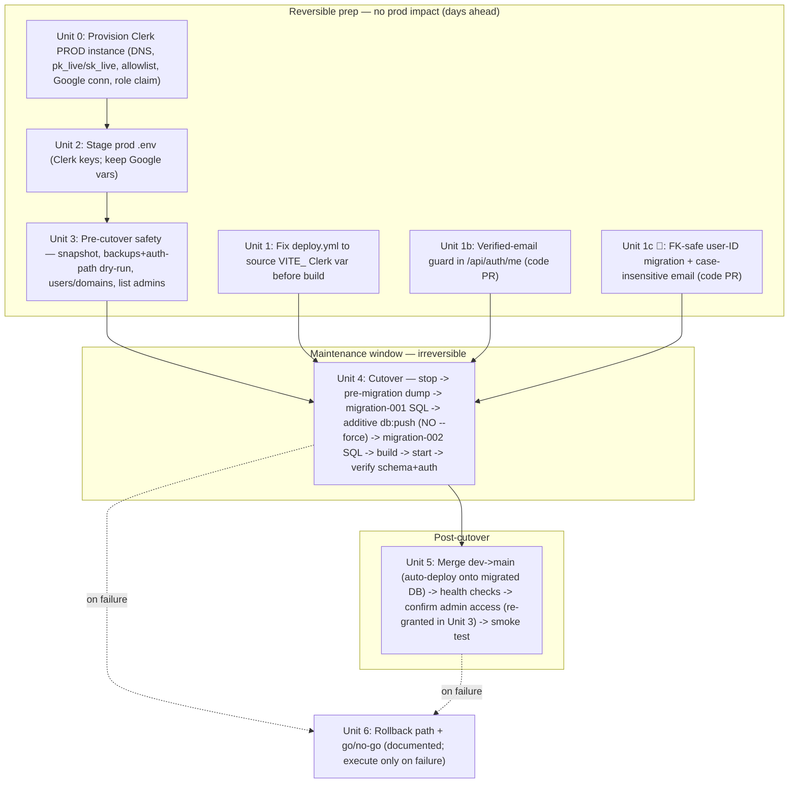

# Production promotion runbook — dev → main

## Overview

Promote `dev` → `main` for expert-in-the-loop (AWS Lightsail, single box). The 43-commit delta bundles **three coupled changes** that land together because the code is inseparable:

1. **PR #7** — campaign-model generalization + evidence tiers (**destructive schema change** + a data-archive step on the prod DB `expertloop`).
2. **PR #8** — campaign-config UX fixes (no schema change).
3. **Auth cutover** — `dev` is **Clerk-only** (Google OAuth code is gone); deploying it to prod necessarily switches production from Google OAuth → Clerk.
4. **Reviewer Focus** (folded in 2026-06-03) — adds the **additive** `campaign_memberships` table (shareable-link reviewer↔campaign join). `db:push` creates it automatically (drops nothing). The reviewer-focus backfill (`scripts/migration-003`) is **dev-only / a no-op on prod** — `migration-002` archives all existing prod campaigns, and the backfill seeds only *active* campaigns, so there's nothing to seed on the clean-slate cutover. See plan `docs/plans/2026-06-03-001-feat-campaign-reviewer-focus-plan.md`.

This is a **maintenance-window cutover**, not a routine deploy. The CI deploy restarts the service but never runs `db:push` — so the schema + auth are operated by hand, in order, with backups and a rollback path.

## Problem Frame

Production currently runs Google OAuth on the pre-generalization schema. The new code references columns/types the prod DB doesn't have yet **and** expects Clerk. The trap (see `docs/solutions/workflow-issues/drizzle-destructive-migration-vs-auto-deploy-2026-05-29.md`): "merge" feels like one action, but the auto-deploy only does the *code* half — restarting the service onto code whose schema and auth backend aren't ready takes prod hard-down. Every irreversible step must be backup-gated and ordered.

## Requirements Trace

- **R1** — Prod runs the PR #7 + #8 code with **no row loss** (5 campaigns, 5,329 pairs, 413 votes, 9 users as of 2026-06-02). **Note:** no rows are deleted, but `migration-002` makes all pre-cutover campaigns **permanently read-only** — in-flight validation work on them is frozen (CSV-exported first as insurance; owner-approved). "No data loss" means rows-preserved, not work-continues.
- **R2** — Prod auth cuts over to **Clerk**; existing prod users log in (email-matched via `/api/auth/me` find-or-create) and current admins retain admin (`publicMetadata.role` on the prod Clerk instance).
- **R3** — The destructive migration runs in the **correct order** (migrate DB → then service restarts on new code), **never `db:push --force`**, with the connect-pg-simple `session` table **preserved** so the Google-OAuth rollback path stays alive.
- **R4** — Every irreversible step is **backup-gated** (pre-migration `pg_dump` via the new `db-backup.sh manual pre-migration` + a manual Lightsail instance snapshot); a **tested rollback** exists.
- **R5** — Deploy via the existing `main` GitHub Actions workflow, **fixed to source the `VITE_` Clerk build var** before `npm run build`; health-checked.
- **R6** — Minimal **scheduled downtime**; explicit go/no-go + rollback criteria.

## Scope Boundaries

- Not changing the generalization or auth **behavior** — this promotes already-merged, QA'd code. (The PR #8 dev QA verification pass — `docs/qa/2026-06-01-campaign-config-ux-verification-checklist.md` — is a **prerequisite** that must pass before this runbook starts.)
- Not migrating pre-cutover prod campaigns into the new model — `migration-002` **archives** them (clean-slate cutover); the new model applies to campaigns created after.
- Not removing the Google OAuth env vars / `session` table during the cutover — they're retained as the rollback anchor (cleanup is a later, separate task once Clerk prod is proven).
- Not changing the backup tooling — it was set up separately (hourly/daily `pg_dump` cron + `db-backup.sh`).

### Deferred to Separate Tasks

- **Post-cutover cleanup** (drop the vestigial `session` table, remove Google OAuth env vars / `connect-pg-simple`, **and rotate/revoke the Google OAuth client secret in Google Cloud Console** — a long-lived credential left live on the box; removing the env var alone does NOT revoke it): a separate task once Clerk prod has run clean for a while. Also update `CLAUDE.md` + `/servers` to say "Production uses Clerk" (the current "still Google OAuth" note will mislead the next operator until changed).
- **True off-box of the hourly dumps** (install `aws` CLI on the box + `s3 sync`): optional hardening, not required for this cutover.

## Context & Research

### Relevant code, scripts, and patterns
- **Authoritative migration sequence** (dev-proven, substitute prod names): `docs/solutions/workflow-issues/drizzle-destructive-migration-vs-auto-deploy-2026-05-29.md` — *the* reference for the on-box sequence; it explicitly notes this "recurs on the prod promotion."
- `scripts/migration-001-generalize-schema.sql` — destructive (pair_type enum→text, DROP TYPE, drop `votes(pair_id,user_id)` unique). **Idempotent**, `BEGIN/COMMIT`. **To extend (Unit 1c):** also drop/re-add the five `users.id` FKs with `ON UPDATE CASCADE` so the auth ID-migration can't FK-violate.
- `scripts/migration-001-rollback.sql` — schema rollback for migration-001.
- `scripts/migration-002-archive-existing.sql` — sets all existing campaigns `status='archived'`. **Idempotent**.
- `.github/workflows/deploy.yml` — `main` deploy: `npm ci && npm run build` → `systemctl restart expert-in-the-loop`. **Does not run `db:push`** (removed). **Gap:** unlike `deploy-dev.yml`, it does **not** source `VITE_` env vars before build — must be fixed for the Clerk publishable key (Unit 1).
- `server/routes.ts` — `/api/auth/me` find-or-create with email-based migration from legacy Google OAuth IDs (the user-migration mechanism).
- Clerk config reference: `CLAUDE.md` "Authentication (Clerk)" — app `app_3DNUUBLOx2pwZayuOHn2nY3DZm7`, FAPI proxy `/api/__clerk` (production only), session-token custom claim `role` → `public_metadata.role`, allowlist `*@phenomehealth.org`.

### Institutional learnings
- `docs/solutions/workflow-issues/drizzle-destructive-migration-vs-auto-deploy-2026-05-29.md` (the sequence + the "merge ≠ migrate" trap).
- `docs/solutions/build-errors/drizzle-zod-jsonb-type-widening-2026-05-29.md` (why `config` is validated with the real zod schema).
- **Session-table sensitivity (inline, since the doc lives on `main`, not this branch):** prod's Google OAuth uses `connect-pg-simple`, whose `session` table is **created outside Drizzle** and is **not** in `shared/schema.ts`. An additive `db:push` leaves unmanaged tables alone, but `db:push --force` would **drop** `session` → killing every active prod session and the Google-OAuth rollback path. This is the sole reason `--force` is forbidden here. (The fuller write-up is the `main`-branch "connect-pg-simple session table" solution doc.)

### Verified prod facts (2026-06-02)
- Daily Lightsail **auto-snapshots ENABLED** (06:00 UTC, 7-day, off-box). New **hourly/daily `pg_dump` cron** installed + restore-verified. `expertloop` 14 MB; `pg_dump -Fc` ≈ 1.3 MB.
- `dev` `server/` has **no** `passport`/`GOOGLE_CLIENT`/`connect-pg-simple` — Clerk-only.
- CI deploy never migrates the DB (confirmed in `deploy.yml`).
- **🔴 `expertloop` is a SHARED database** — beyond the 8 app tables it carries **unmanaged** tables: `session` (connect-pg-simple / OAuth rollback anchor), `kraken_conversations/feedback/tool_calls/turns/users` (the KRAKEN app), and `alembic_version`. `dev`'s `expertloop_dev` does NOT have these (which is why dev `db:push` looked clean). **`tablesFilter` in `drizzle.config.ts` is therefore REQUIRED** so `db:push` reconciles only this app's tables and can't drop/rename the others.
- **🔬 Full migration dry-run PASSED (2026-06-03)** against a restored copy of prod (`expertloop_dryrun`, dropped after; zero prod impact): migration-001 clean on real enum data (`pair_type`→text, enum dropped, votes-unique dropped, 5 `users.id` FKs → `ON UPDATE CASCADE`); `db:push` (with `tablesFilter`) additive-only and **non-interactive**, `session`/`kraken_*`/`alembic_version` untouched; migration-002 archived all 6 campaigns; migration-003 a confirmed `INSERT 0 0` no-op; the **FK-safe auth ID-migration re-pointed a real 334-vote user with zero FK violations**; row counts unchanged (10/5329/413), `evidence_status` fully DEFAULT-populated. Re-run the dry-run if prod schema changes before the window.

## Key Technical Decisions

- **Combined cutover, phased.** The Clerk-only code makes auth + schema inseparable in one deploy, but the risk is contained by front-loading all **reversible** prep (Clerk prod provisioning, env staging, workflow fix, backups) into phases that don't touch prod, then doing the irreversible schema+restart in a single short window.
- **Clerk: production instance of the existing app** (not a new app). Requires DNS/CNAME + `pk_live`/`sk_live`; the prod instance is configured **independently** of dev (allowlist, Google connection, **session-token role claim** must all be re-set on prod).
- **`db:push` additive-only, never `--force`.** Destructive steps live in hand-written idempotent SQL (`migration-001`); `db:push` only adds the new columns (populated by DEFAULTs). `--force` would drop the unmanaged `session` table and kill the Google-OAuth rollback.
- **Backup-before-irreversible.** A `db-backup.sh manual pre-migration` dump + a manual instance snapshot are the rollback anchors, taken with the service stopped.
- **Merge AFTER the box is migrated.** Migrate + verify on the box first (checkout the code), then merge `dev→main` so the auto-deploy fast-forwards onto an already-DB-ready, already-running state.

## Open Questions

### Resolved during planning
- *Is the Clerk prod instance set up?* → **DNS verified (2026-06-02)**; remaining Unit 0 = dashboard config (allowlist, Google connection, role claim) + `pk_live`/`sk_live` capture.
- *Can the auth cutover be decoupled from the schema promotion?* → **No** — `dev` is Clerk-only; the code can't run on Google OAuth. Contained via phasing instead.
- *Does CI auto-migrate?* → No (`deploy.yml`); schema is manual via SSH.
- *Does the prod deploy workflow build the Clerk publishable key in?* → **Not yet** — `deploy.yml` lacks the `VITE_` sourcing that `deploy-dev.yml` has (Unit 1).

### Open decisions — RESOLVED with the user (2026-06-02)
- **🔴 Archiving all current prod campaigns → the 413 votes are REAL WORK.** Keep the clean-slate archive, but **(a)** export all 5 campaigns to CSV before `migration-002` (Unit 3) as durable, portable insurance, and **(b)** get explicit **campaign-owner sign-off** that read-only archived access is acceptable. R1's "no data loss" is reframed below to mean rows-preserved, not work-continues.
- **Email-verification guard → ADD IT** (Unit 1b, a small pre-promotion code change): require `primaryEmailAddress.verification.status === 'verified'` before `/api/auth/me` migrates a local user to a Clerk ID.

### Surfaced by the 2026-06-02 review — RESOLVED (2026-06-02)
- **🔴 FK-safe user-ID migration (Unit 1c) → approach A: `ON UPDATE CASCADE`.** Add `onUpdate:"cascade"` to the five `users.id` FKs in `shared/schema.ts` + drop/re-add them with CASCADE in `migration-001`. DB-enforced and atomic; `updateUserId` stays trivial; can't miss a table. Blocking prerequisite — without it no existing user can log in post-cutover.
- **Archive vs forward-migrate → KEEP clean-slate archive.** Forward-migration was considered (the new columns get DEFAULTs, so it's technically plausible) but **rejected for this cutover**: it would add default-`config` backfill + `evidence_status` recompute from the 413 existing votes + old→new vote-semantics mapping — extra risk inside the window for campaigns that are being archived (preserved as rows), not reinterpreted. The existing 5 campaigns freeze read-only, CSV-exported with owner sign-off (Unit 3). **Continuity, if a specific campaign later needs it, is a separate post-cutover task** (re-create + CSV re-import) — not part of this promotion.

### Deferred to implementation
- Exact maintenance-window time + reviewer notification — schedule at execution (off-hours; the cutover invalidates all sessions, so everyone re-logs-in via Clerk).
- The precise set of prod admins to enumerate for re-granting (the re-grant itself happens in Unit 3, pre-window) — list from the prod `users` table at execution.
- Whether any prod user emails fall outside `*@phenomehealth.org` (would need allowlist additions) — verify at execution (Unit 3).

## High-Level Technical Design

> *Directional guidance for review, not implementation specification.*

## Implementation Units

> Ops runbook: "tests" are **verification gates**. Each window step has a gate that must pass before the next.

- [ ] **Unit 0: Provision the Clerk production instance** *(lead-time prerequisite — start days ahead)*

**Goal:** A working Clerk **production** instance for `expertintheloop.io`, configured to match the dev instance's behavior.

**Requirements:** R2

**Dependencies:** None (does not touch prod app/DB).

**Files:** None in-repo — Clerk Dashboard + Squarespace DNS.

**Approach:**
- ✅ **DNS verified (2026-06-02):** the Clerk production instance's **DNS/CNAME records for `expertintheloop.io` are in place and verified** — the longest-lead leg is done. Remaining Unit 0 work is the dashboard configuration + keys below.
- In the existing Clerk app, ensure the **production instance** is active for `expertintheloop.io`.
- Configure on the **prod** instance (these do NOT inherit from dev): the **Google social connection**, the **allowlist** (`*@phenomehealth.org`), and the **session-token custom claim** `role` → `{{user.public_metadata.role}}` (this is what `requireAdmin` reads — see `server/auth.ts`).
- Capture `pk_live` / `sk_live` for Unit 2.

**Test scenarios:**
- Integration (manual): the Clerk prod FAPI domain resolves + serves; a test sign-in on a throwaway preview works; the session token for a test user with `public_metadata.role=admin` carries `role: "admin"`.

**Verification:** Prod instance status "active", domain verified, `pk_live`/`sk_live` issued, allowlist + Google connection + role claim all present on the **prod** instance.

- [ ] **Unit 1: Bring `deploy.yml` to parity with `deploy-dev.yml` — as a standalone PR merged BEFORE the window**

**Goal:** `main` deploys build the Clerk bundle correctly and fail loudly on error. This is a **code change**, so it ships as its **own small PR merged to `main` ahead of the runbook** (not inside the maintenance window) — scope-keeping; Unit 4 then just relies on a green, already-merged workflow.

**Requirements:** R5

**Dependencies:** None (do first, days ahead).

**Files:**
- Modify: `.github/workflows/deploy.yml`

**Approach:** Mirror `deploy-dev.yml` exactly, closing **three** gaps the review found:
1. **Source ALL `VITE_` vars** before `npm run build` (the dev workflow uses `set -a; source <(grep '^VITE_' .env); set +a`) — this captures both `VITE_CLERK_PUBLISHABLE_KEY` **and `VITE_CLERK_PROXY_URL`** (the prod custom-domain/FAPI-proxy needs the proxy URL — `client/src/App.tsx` reads `import.meta.env.VITE_CLERK_PROXY_URL`). Do **not** narrow to just the publishable key.
2. **Add `set -e`** as the first line of the deploy heredoc — `deploy.yml` currently lacks it, so a failed `git pull`/`build` doesn't abort and `systemctl restart` runs anyway.
3. **Real health check** — replace the non-failing `curl … | grep -q "200" && … || echo` with `curl -sf http://localhost:5000 > /dev/null` (under `set -e`) so a broken boot fails the job; note that even this only proves the shell serves, not that Clerk/DB are healthy — the **manual Unit 5 smoke test is the authoritative gate**, not "Actions green."

**Patterns to follow:** `.github/workflows/deploy-dev.yml` (its `set -e`, `grep '^VITE_'` sourcing, and `curl -sf` health check).

**Test scenarios:**
- Happy path: after merge + a deploy, the served prod JS bundle embeds both the `pk_live` key and the proxy URL; Clerk initializes (no "missing publishable key" / proxy error).
- Error path: a failing build aborts the deploy (job red), and the service is not restarted onto a broken bundle.

**Verification:** The fix is **merged to `main` and green** before Unit 4 starts; a deploy yields a working Clerk-enabled prod frontend.

- [ ] **Unit 1b: Verified-email guard in `/api/auth/me` (pre-window code change)**

**Goal:** Prevent an unverified Clerk email from claiming an existing local account during the cutover (when every prod user hits the find-or-create path fresh).

**Requirements:** R2

**Dependencies:** None (a small standalone PR, merged before the window — ideally before the dev QA pass so it's exercised there too).

**Files:**
- Modify: `server/routes.ts` (`/api/auth/me` find-or-create)
- Test: `server/*.test.ts` (or the existing auth test surface)

**Approach:** Before reassigning a matched local user to the Clerk ID, require `clerkUser.primaryEmailAddress?.verification?.status === "verified"`. If not verified, do **not** migrate the ID (return 403 / treat as unauthenticated). Also avoid the `"unknown@unknown.com"` fallback path silently creating/matching accounts.

**Test scenarios:**
- Happy path: a verified-primary-email Clerk user matches and migrates to their existing local row.
- Error path: an **unverified** primary email does **not** trigger the ID migration (no takeover); no account is silently created under `unknown@unknown.com`.

**Verification:** Merged to `main` ahead of the window; the unverified-email case is covered by a test.

> **Caveat (review 2026-06-02):** confirm the installed backend Clerk SDK actually exposes `primaryEmailAddress.verification.status` on `clerkClient.users.getUser()` (and that social-connection/Google emails report the literal string `'verified'`). If not, the guard's deny path 403s **every** prod user at cutover. Verify against the prod instance before relying on it.

- [ ] **Unit 1c: Make the `/api/auth/me` migration path prod-safe (pre-window code change) 🔴**

**Goal:** The user-ID migration that *every* existing prod user triggers on first Clerk login must not fail. Two latent bugs in the current path (surfaced by the 2026-06-02 review) would otherwise lock out all 9 users — admins included — at cutover. **This is the review's P0.**

**Requirements:** R2

**Dependencies:** None (a standalone PR merged before the window — ideally before the dev QA pass so it's exercised there). Pairs naturally with Unit 1b (same file/path).

**Files:**
- Modify: `server/storage.ts` (`updateUserId`, `getUserByEmail`)
- Modify: `shared/schema.ts` (add `onUpdate: "cascade"` to the 5 `users.id` FKs) + `scripts/migration-001-generalize-schema.sql` (drop/re-add those 5 FKs with `ON UPDATE CASCADE`)
- Test: server test surface (see Unit 1b note on test infra)

**Approach — two defects, both in the find-or-create path all prod users hit cold:**
1. **🔴 FK-safe ID migration.** `updateUserId` runs `UPDATE users SET id = <clerkId>` while `campaigns.created_by`, `votes.user_id`, `allowed_domains.added_by`, `skipped_pairs.user_id`, `import_templates.created_by` reference `users.id` with **no `ON UPDATE` rule (Postgres default `NO ACTION`)**. The update is **rejected by a foreign-key violation** for any user with referencing rows (all real users) → `/api/auth/me` 500 → can't log in. Dev never caught this (fresh/wiped users had no referencing rows). **Decided (2026-06-02): approach A — `ON UPDATE CASCADE`.** Add `{ onUpdate: "cascade" }` to the five `.references(() => users.id)` calls in `shared/schema.ts`, and on prod **drop/re-add those five FK constraints with `ON UPDATE CASCADE` inside `migration-001`** (it already does constraint surgery). Postgres then re-points all child rows atomically when `updateUserId` changes the PK; the function stays a one-liner and can't "miss a table." Annotating `schema.ts` keeps `db:push` from seeing a constraint diff. Apply the same CASCADE on **dev** too (so dev/prod match and the dev QA pass exercises the migration path).
2. **Case-insensitive email match.** `getUserByEmail` uses `eq(users.email, email)` (exact, case-sensitive). If Clerk/Google return different casing than the stored Google-OAuth email, the match misses → a **duplicate row is created defaulting `role:'reviewer'`**, silently demoting an admin. Normalize both sides (`lower(...)`) on match.

**Test scenarios:**
- 🔴 Happy path: a user who **owns campaigns + votes** is migrated old-id → Clerk-id with **all** their campaigns/votes/pairs still attached (no FK error, no orphan). The exact case dev never exercised.
- Edge case: stored `First.Last@phenomehealth.org` matches Clerk primary `first.last@phenomehealth.org` onto the existing row — no duplicate, role preserved.
- Error path: an unverified primary email (Unit 1b) still blocks migration.

**Verification:** Merged to `main` ahead of the window; FK-safe migration + case-insensitive match covered by tests run **against a user with referencing rows**.

- [ ] **Unit 2: Stage the production `.env`**

**Goal:** Prod `.env` (`/home/ubuntu/expert-in-the-loop/.env`) has the Clerk vars; Google vars retained for rollback.

**Requirements:** R2, R3

**Dependencies:** Unit 0 (keys).

**Files:** None in-repo (on-box `.env`).

**Approach:** Add `CLERK_SECRET_KEY` (`sk_live`), `CLERK_PUBLISHABLE_KEY` + `VITE_CLERK_PUBLISHABLE_KEY` (`pk_live`), **`VITE_CLERK_PROXY_URL`** (e.g. `https://expertintheloop.io/api/__clerk` — required: prod is custom-domain + FAPI-proxied; missing it ships `proxyUrl=undefined`), and `ALLOWED_EMAIL_DOMAINS`. **Keep** `GOOGLE_CLIENT_ID/SECRET`, `SESSION_SECRET` (unused by new code, needed for rollback). Caveats from review:
- **`CLERK_SECRET_KEY` must be present** — `server/auth.ts` *silently disables the FAPI proxy* in production if it's unset, so login fails in a non-obvious way.
- **`ALLOWED_EMAIL_DOMAINS` is non-functional server-side** (the code only references it in a comment; the real domain gate is the Clerk Dashboard allowlist verified in Unit 0). Don't rely on the env var as the access control.
- systemd `EnvironmentFile` caveat — **no special chars like `!`/spaces** in values (per `CLAUDE.md`); set the `.env` to `chmod 600`.

**Test scenarios:**
- Edge case: a value containing `!` or `=`/quotes is rejected/escaped — confirm the service still parses `.env` after the edit (`systemctl show` env, or a no-op restart on a scratch check).

**Verification:** `.env` contains all Clerk keys + allowlist; Google vars still present; **`stat -c '%a' .env` returns `600`** (the box is shared with biomapper/kraken/pgs running as the same `ubuntu` user — a world-readable `.env` leaks `CLERK_SECRET_KEY` + the Google secret); staged but **not yet deployed**.

- [ ] **Unit 3: Pre-cutover safety + readiness**

**Goal:** Rollback anchors exist and prod users are Clerk-ready.

**Requirements:** R2, R4, R6 *(this unit owns scheduling/communicating the window — see the cron-pause + 06:00-avoidance + reviewer-notification steps below)*

**Dependencies:** Unit 0.

**Files:** None in-repo (box + AWS + Clerk).

**Approach:**
- Take a **manual Lightsail instance snapshot** (point-in-time, retained until deleted — unlike the 7-day auto ones).
- Run `db-backup.sh manual pre-migration` and **test-restore** it into a throwaway DB (as already proven for the tooling).
- **Export all 5 current prod campaigns to CSV** (via the current service's export route, while it's still up) and store the files alongside the pre-migration dump — portable, owner-usable insurance since `migration-002` freezes them read-only. **Get explicit campaign-owner sign-off** that read-only archived access is acceptable; record who approved.
- **🔬 Migration dry-run (rehearsal):** restore the prod dump into a **scratch DB**, then run `migration-001` SQL + `db:push` **there** and **capture the exact `db:push` interactive prompt sequence + correct answers** and confirm the plan is **ADD-only (no DROP, `session` table intact)**. `db:push` is interactive and has no true dry-run — this rehearsal against *prod-shaped* data (prod has the `session` table dev lacks) is the only way to know the real prompts before the live window.
  - **⚠️ Point `DATABASE_URL` at the scratch DB explicitly** for every command in the rehearsal (`drizzle.config.ts` reads `process.env.DATABASE_URL`). If you instead source the staged prod `.env` here, `db:push` runs its **interactive, destructive push against LIVE prod** pre-window — the exact event this runbook exists to gate. Verify with `psql "$DATABASE_URL" -c '\conninfo'` before each push.
  - **🔴 Rehearse the auth migration path too** (not just the schema): against the restored scratch DB, exercise `/api/auth/me` find-or-create for a real prod user **who owns campaigns/votes**, confirming the Unit 1c FK-safe migration lands them on their existing row with all data attached. The schema dry-run alone does NOT cover this — it is exactly where the P0 (FK violation on `updateUserId`) hides.
  - **Confirm prod schema is unchanged between this rehearsal and the window** (no out-of-band ALTERs) — otherwise the captured prompt playbook can diverge from the live prompts.
- **Admin role grant is now automatic (role-sync, PR #11) — manual pre-grant no longer required.** `/api/auth/me` reconciles each user's authoritative DB role into Clerk `publicMetadata` on every login (self-healing, failure-isolated), so the 9 admins regain admin automatically on first post-cutover login. The only residual is a **sub-minute first-token gap** (the very first token is minted before `/api/auth/me` runs; the role lands on the next refresh/reload — Unit 5 already has admins confirm access by reloading once). *Optional:* to eliminate even that gap, pre-seed the admins via the Clerk Dashboard or `npx clerk api` before the window — but it's belt-and-suspenders, not required. Still enumerate prod admins from the prod DB `users` table so Unit 5 knows who to confirm.
- Enumerate prod `users` (emails); confirm **all** emails are within the allowlist domain (add to the Clerk allowlist if not) **and** that the Google connection on the prod instance will return them as **verified primary** emails (so the `/api/auth/me` email-match lands them on their existing row, not `unknown@unknown.com` or a duplicate).
- **Verify the allowlist actually blocks** a non-`@phenomehealth.org` test account on the **prod** instance (server has no independent domain check — the allowlist is the only gate).
- **Pre-stage the reviewer notification** (window time; "you'll be signed out and must sign in again via the same Google account; your account is preserved; contact X if login fails").
- **Schedule the window to avoid 06:00 UTC** (auto-snapshot) and **pause the hourly `pg_dump` cron** for the window's duration — otherwise it can capture a half-migrated DB that later masquerades as a good restore point.

**Test scenarios:**
- Happy path: the manual snapshot shows "available"; the pre-migration dump restores with row-count parity; the dry-run `db:push` plan is ADD-only with `session` intact.
- Edge case: a prod user email outside `*@phenomehealth.org` is found → allowlist updated (or flagged) before the window.
- Error path: a non-allowlisted test account is **rejected** on the prod Clerk instance.

**Verification:** Snapshot available; restore-verified dump in `manual/`; dry-run captured the prompt playbook + confirmed ADD-only; **admin list enumerated** (role-sync grants them automatically on first login — Unit 5 confirms); all prod users covered by the (two-domain) allowlist with verified primary emails; reviewer notice drafted; cron paused + window avoids 06:00.

- [ ] **Unit 4: The cutover (maintenance window — irreversible)**

**Goal:** Prod DB migrated to the generalization schema + archived; service running the new (Clerk) code; auth working.

**Requirements:** R1, R2, R3, R6

**Dependencies:** Units 0–3.

**Files (run, not modified):** `scripts/migration-001-generalize-schema.sql`, `scripts/migration-002-archive-existing.sql`.

**Approach:** Follow the **authoritative sequence** in the solution doc, substituting prod names (`expertloop`, `expert-in-the-loop`, `/home/ubuntu/expert-in-the-loop`), with the prod-specific deltas:
1. Stop `expert-in-the-loop`. **Gate:** confirm `systemctl is-active` = inactive AND nothing is listening on :5000 (`ss -ltnp`). If the unit has `Restart=always`, **`systemctl mask`** it for the window so it can't auto-resurrect the **old** code against the migrated DB (unmask at step 9).
2. `db-backup.sh manual pre-migration` (fresh dump with service stopped).
3. Check out the new code on the box (so `scripts/` + new `schema.ts` are present before the service runs new code).
4. `npm ci`.
5. Run `migration-001` SQL (destructive, idempotent) — now also re-creates the five `users.id` FKs with `ON UPDATE CASCADE` (Unit 1c) so the post-cutover auth ID-migration can't FK-violate.
6. Source `.env`; **assert `DATABASE_URL` resolves to `expertloop`** (`psql "$DATABASE_URL" -c '\conninfo'`) so the push can't accidentally target a sibling DB on the shared box; then run `db:push`. **The `tablesFilter` in `drizzle.config.ts` scopes push to this app's 8 tables** — the **2026-06-03 dry-run against a restored prod copy confirmed `db:push` applies cleanly and NON-interactively** (additive: the generalization columns + the `campaign_memberships` table), **leaving the shared DB's unmanaged tables — `session`, `kraken_*`, `alembic_version` — untouched**. Expect the output `[✓] Changes applied` with **no prompt at all**. 🔴 **If ANY interactive prompt appears** (a rename/drop menu = the `tablesFilter` regressed or a new unmanaged table appeared), **ABORT to Unit 6** — never `--force`, never confirm a rename/drop.
7. Run `migration-002` SQL (archive existing campaigns). *(See the open product decision — archiving freezes all current prod campaigns.)*
8. `npm run build`.
9. **Before start, assert `grep -q '^CLERK_SECRET_KEY=' .env`** — `server/auth.ts` *silently* disables the FAPI proxy in production if it's unset, so login fails in a non-obvious way (app appears up, no one can authenticate). Then start `expert-in-the-loop` (unmask first if masked in step 1). Check out / fast-forward the box to **the exact commit being promoted (current `dev` HEAD)** — not the stale `main`, which hasn't been merged yet — so the Unit 5 auto-deploy `git pull origin main` (after the merge) is a clean fast-forward.

**Execution note:** This is the only irreversible unit. Do not proceed past any gate that fails — go to Unit 6.

**Test scenarios (verification gates):**
- Schema: `\d pairs` → `pair_type` is `text`; `\d votes` → no `(pair_id,user_id)` unique; new columns (`evidence_status`, `resolution_layer`, `superseded_by`, `is_active`, `recompute_status`) present.
- Data integrity: pre/post `COUNT(*)` for `campaigns/pairs/votes/users` **unchanged**; `evidence_status`/`resolution_layer` non-null on all pairs (DEFAULT-populated); all campaigns `status='archived'`.
- `db:push` safety: the push plan shows **no DROP** statements and the `session` table still exists afterward.
- Auth (end-to-end, not just "shell serves"): the **FAPI proxy** `/api/__clerk` returns a healthy Clerk response (not 502 — depends on `CLERK_SECRET_KEY` being set and the prod instance's allowed origins/redirect URLs including `expertintheloop.io`, not just dev); a **real sign-in via Clerk (Google) completes the token exchange** and lands on the dashboard (no login loop); `/api/auth/me` returns the **existing** (email-matched) user with `role` metadata.

**Verification:** All gates green; prod up on the new code with working end-to-end Clerk login (proxy + token exchange, not just a 200 shell) and intact data. **Do not reopen the app to reviewers until the Unit 6 go/no-go is fully cleared (rollback-safe window).**

- [ ] **Unit 5: Merge, deploy, and post-cutover validation**

**Goal:** `main` reflects the promoted code; admin access **verified** (roles were re-granted pre-window in Unit 3); prod smoke-tested end-to-end.

**Requirements:** R1, R2, R5

**Dependencies:** Unit 4 green.

**Files:** None in-repo (GitHub merge + Clerk Dashboard).

**Approach:**
- Merge `dev → main` (this is the project's PR workflow — budget PR-creation/review time into the window, or pre-stage the PR). The auto-deploy fast-forwards onto the **already-migrated, already-running** box (a no-op-ish restart on the same code). The Actions run going green is **not** the authoritative gate (even with the Unit 1 fix, a 200 only proves the shell serves) — the **manual smoke test below is**.
- Admin roles were **already re-granted pre-window (Unit 3)** — here, just confirm each admin can reach `admin/*` (their first post-cutover login mints a token already carrying `role:admin`).
- Smoke test on prod: login (Clerk) → create a campaign → import a few pairs → vote → export CSV → archived pre-cutover campaigns are read-only.
- **Open an archived pre-cutover campaign's Results AND Analytics views under the new code.** `campaigns.config` jsonb has no SQL default, so the 5 archived campaigns are `config=NULL` post-cutover; the new generalized results/analytics/config-editor read `config`. A null-config crash here would make exactly the "preserved" historical data **unviewable** (rows kept, but the screens error) — verify these render, don't just that the campaign rejects writes.
- **Confirm each of the known prod users successfully re-authenticated** (or follow up with any who didn't) — a silently locked-out reviewer should be caught, not lost.
- Re-enable the hourly `pg_dump` cron (paused in Unit 3) and take a **fresh `manual success` dump** before declaring done (the pre-migration dump is now stale).

**Test scenarios:**
- Integration (manual): admin can reach `admin/*`; a reviewer can vote; export downloads; a pre-cutover (archived) campaign rejects new votes (server 403).
- Edge case: an existing prod user (previously Google OAuth) signs in via Clerk and lands on **their** existing account (email-matched), not a duplicate.

**Verification:** Actions deploy green; admins have admin; full smoke test passes on `expertintheloop.io`.

- [ ] **Unit 6: Rollback path + go/no-go (documented; execute only on failure)**

**Goal:** A rehearsed way back to the pre-promotion state.

**Requirements:** R3, R4

**Dependencies:** Backups from Units 3–4.

**Files (reference):** `scripts/migration-001-rollback.sql`; the pre-migration dump; the manual snapshot.

**⏳ Rollback-safe window (critical):** keep prod effectively **write-frozen** (all campaigns are archived = read-only; also hold off creating new campaigns / reopening) until **every** go/no-go below is cleared. The pre-migration dump goes **stale the instant any new-model write occurs**, and `migration-001-rollback.sql` **hard-fails the moment any vote is edited** (it can't re-add the `(pair_id,user_id)` unique constraint once a supersession row exists). **"Write" includes server-initiated writes**, not just reviewer actions: startup `recompute_status` reconciliation, evidence-status recompute, or a `lastActive` update on the operator's own verification login can each stale the anchor before any human votes — so do the go/no-go decision promptly and avoid triggering recomputes during verification. So:
- **Before any vote edit:** schema-only revert is available — restore the pre-migration `pg_dump` **or** apply `migration-001-rollback.sql`.
- **After the first vote edit:** `migration-001-rollback.sql` is **dead**; the only path is restoring the pre-migration `pg_dump` (accepting loss of any post-cutover writes) or the instance snapshot.

**Approach (decision aid, not run unless triggered):**
- **Full revert:** restore the pre-migration dump → revert `main` to the pre-promotion commit → redeploy (the Google-OAuth code) → confirm `.env` still has the Google vars and the **`session` table is intact** (it is, because no `--force`).
- **Worst case:** restore the manual Lightsail instance snapshot (whole box).
- **In every rollback path:** re-enable the hourly `pg_dump` cron (paused in Unit 3) as the first action once the service is restored — a failed cutover must not also leave the box with no automated backups.

**Go/No-Go criteria (trigger rollback, while still write-frozen, if):** `db:push` shows any DROP / non-additive change or an unexpected interactive prompt; post-migration row counts differ; the service won't start / fails the smoke test; the **FAPI proxy 502s** or Clerk login can't complete token exchange for valid `@phenomehealth.org` users and isn't a quick config fix; admins can't reach `admin/*`. **Decide before reopening writes** — once reviewers vote, rollback means accepted data loss.

**Verification:** Before the window, a **dry-run restore** of the pre-migration dump into a throwaway DB (as in Unit 3) confirms the anchor is good. (Do not execute the prod rollback unless a Go/No-Go criterion fires.)

## System-Wide Impact

- **Shared box:** the Lightsail host also runs biomapper-ui, biomapper2, kraken, pgs-catalog. The cutover only stops/starts `expert-in-the-loop`; **do not** touch sibling services. PostgreSQL is shared — only `expertloop` is migrated; `kraken_dev` and others are untouched.
- **Auth blast radius:** every active prod session is invalidated at cutover (Google → Clerk); all users re-authenticate. Communicate the window.
- **State lifecycle:** the `session` table becomes vestigial post-cutover but is **deliberately retained** (rollback anchor). `migration-001`/`002` are idempotent — safe to re-run if a step is interrupted.
- **CI parity:** `deploy.yml` and `deploy-dev.yml` must both source `VITE_` (Unit 1 closes the gap) — otherwise prod ships a Clerk-less bundle.
- **Unchanged invariants:** no behavior change to the generalization/auth code (already QA'd on dev); the prod data is preserved (clean-slate **archives**, doesn't reinterpret); sibling services and their DBs untouched.

## Risk Analysis & Mitigation

| Risk | Likelihood | Impact | Mitigation |
|------|-----------|--------|------------|
| `db:push --force` (or an interactive prompt answered wrong) drops the `session` table → Google-OAuth rollback dead | Med | High | Never `--force`; review the push plan for DROPs before applying; `session` table is unmanaged by Drizzle so additive push leaves it alone. |
| Service restarts on new code before the DB is migrated (the classic trap) → prod hard-down | Med | High | Migrate on the box **with service stopped**, verify, then start; merge only after. CI never migrates. |
| Clerk prod misconfigured (missing role claim / allowlist / Google conn / DNS not propagated) → admins locked out or no one can log in | Med | High | Unit 0 provisions + verifies prod instance **before** the window; Unit 1/2 build+ship the keys; Unit 5 re-grants admin and smoke-tests. |
| Prod build ships no Clerk publishable key (deploy.yml gap) | Med | High | Unit 1 fixes the workflow; Unit 4/5 verify the bundle initializes Clerk. |
| Existing prod user can't reach their account post-cutover (email mismatch / outside allowlist) | Low | Med | Unit 3 verifies all prod emails vs allowlist; `/api/auth/me` email-match migration handles ID change; Unit 5 verifies no duplicate accounts. |
| Data loss during migration | Low | High | Pre-migration `pg_dump` (restore-tested) + manual instance snapshot + daily auto-snapshot; idempotent SQL; row-count parity gate. |
| Long/under-communicated downtime | Low | Med | Off-hours scheduled window; sequence is minutes (DBs are tiny); notify reviewers. |
| `db:push` is interactive — a mis-answered prompt (rename/truncate) silently corrupts/drops data | Med | High | Capture the exact prompt sequence + answers in the Unit 3 dry-run against a restored prod dump; playbook in Unit 4 step 6; ABORT on any unexpected prompt. |
| `deploy.yml` health check / "Actions green" is not load-bearing (no `set -e`, swallows failure, 200 ≠ healthy) | Med | Med | Unit 1 adds `set -e` + `curl -sf`; the **manual smoke test** is the authoritative gate, not the green run. |
| Email-match migration trusts an **unverified** Clerk primary email → account takeover / orphaned votes | Low | High | **Unit 1b adds a server-side `verification.status==='verified'` guard** before ID migration; Unit 3 also confirms the Google connection returns verified primary emails. |
| Rollback dump goes stale / `migration-001-rollback.sql` dies after first vote edit | Med | High | Rollback-safe write-freeze until go/no-go cleared; explicit expiry stated in Unit 6; fresh dump before declaring success. |
| Hourly `pg_dump` cron or 06:00 auto-snapshot captures a half-migrated DB / I-O contention | Med | Med | Unit 3 pauses the cron + schedules the window away from 06:00 UTC. |
| Old code auto-restarts (systemd `Restart=always`) against the migrated DB mid-window | Low | High | Unit 4 step 1 verifies inactive + masks the unit during the window. |
| FAPI proxy 502 / wrong allowed-origins → Clerk login "half-works" | Med | High | Unit 0/4 verify `CLERK_SECRET_KEY` set, allowed origins include `expertintheloop.io`, and `/api/__clerk` returns healthy. |
| **🔴 `updateUserId` PK update violates FKs (no `ON UPDATE CASCADE`) → every existing user 500s on first login** | **High** | **High** | **Unit 1c** fixes the migration to be FK-safe (CASCADE or transactional re-point); **Unit 3 rehearses the auth path** against a restored user with campaigns/votes; smoke test confirms an existing user lands on their row. |
| Case-sensitive email match → duplicate row, admin silently demoted to reviewer | Med | Med | Unit 1c normalizes email casing on match; Unit 3 verifies per-user casing parity between Google and the stored email. |
| Archived campaigns are `config=NULL` → new code crashes on their Results/Analytics views | Med | Med | Unit 5 smoke test opens an archived campaign's Results + Analytics under the new code (not just the read-only write check). |
| Dry-run `db:push` run with prod `DATABASE_URL` sourced → destructive push hits LIVE prod pre-window | Med | High | Unit 3 scopes `DATABASE_URL` to the scratch DB explicitly + `\conninfo` check; Unit 4 step 6 asserts `DATABASE_URL=expertloop` before pushing. |
| CI auto-deploy (`deploy.yml`) restarts the box mid-window on a stray push to `main` → restart onto half-migrated DB | Low | High | Beyond masking the systemd unit, disable/guard the `deploy.yml` workflow for the window; merge `dev→main` only in Unit 5 after the box is migrated. |

## Documentation / Operational Notes

- **Run only after** the dev QA verification pass (`docs/qa/2026-06-01-campaign-config-ux-verification-checklist.md`) is green.
- **Operator & sign-off:** name a primary operator; for the two irreversible actions (the `db:push` prompts, `migration-002`) require a second person (or a logged self-checklist) to confirm "plan shows no DROP" + row-count parity before proceeding; paste the actual command outputs into a run log.
- Backups: hourly/daily `pg_dump` cron + `db-backup.sh` already in place; this runbook adds the **manual** pre-migration dump + instance snapshot (and a fresh `manual success` dump at the end).
- "**Clean run**" = Unit 5 complete + the service error-free for ~24 h. After that soak, do the **deferred cleanup**: drop the vestigial `session` table, remove Google env/`connect-pg-simple`, and **rotate (revoke + replace) the Google OAuth client secret in Google Cloud Console** — it's a long-lived credential left live on the box; removing the env var alone doesn't revoke it.
- Update `CLAUDE.md` and `/servers` once prod is on Clerk (prod `.env` keys, "Production uses Clerk" instead of "still Google OAuth") — do this in the soak period so it isn't forgotten.
- **Pre-existing hardening surfaced by the security review (separate, not blockers for this cutover):** `.env` → `chmod 600`; CI SSH uses `StrictHostKeyChecking=no` (pin the host key); `/api/database/query` raw-SQL endpoint (blocklist-based) and the unbounded multer upload size — worth tracking as their own issues.

## Sources & References

- Migration sequence + trap: `docs/solutions/workflow-issues/drizzle-destructive-migration-vs-auto-deploy-2026-05-29.md`
- Session-table sensitivity: `docs/solutions/build-errors/` (connect-pg-simple) ; jsonb widening: `docs/solutions/build-errors/drizzle-zod-jsonb-type-widening-2026-05-29.md`
- Scripts: `scripts/migration-001-generalize-schema.sql`, `scripts/migration-001-rollback.sql`, `scripts/migration-002-archive-existing.sql`
- Workflows: `.github/workflows/deploy.yml`, `.github/workflows/deploy-dev.yml`
- Auth: `server/auth.ts`, `server/routes.ts` (`/api/auth/me`), `CLAUDE.md` "Authentication (Clerk)"
- Upstream plan: `docs/plans/2026-05-28-001-refactor-campaign-model-generalization-plan.md`
- Backup tooling: `/home/ubuntu/scripts/db-backup.sh` (on the box)
